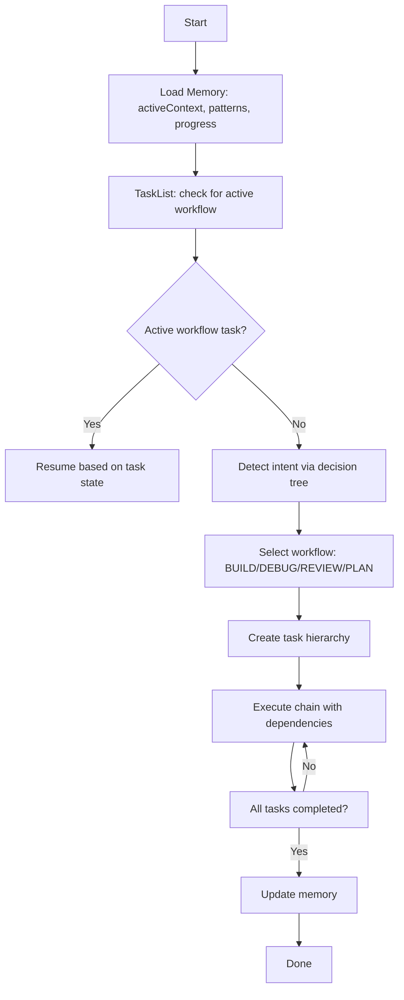
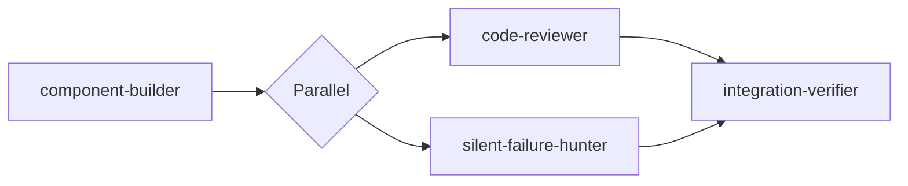
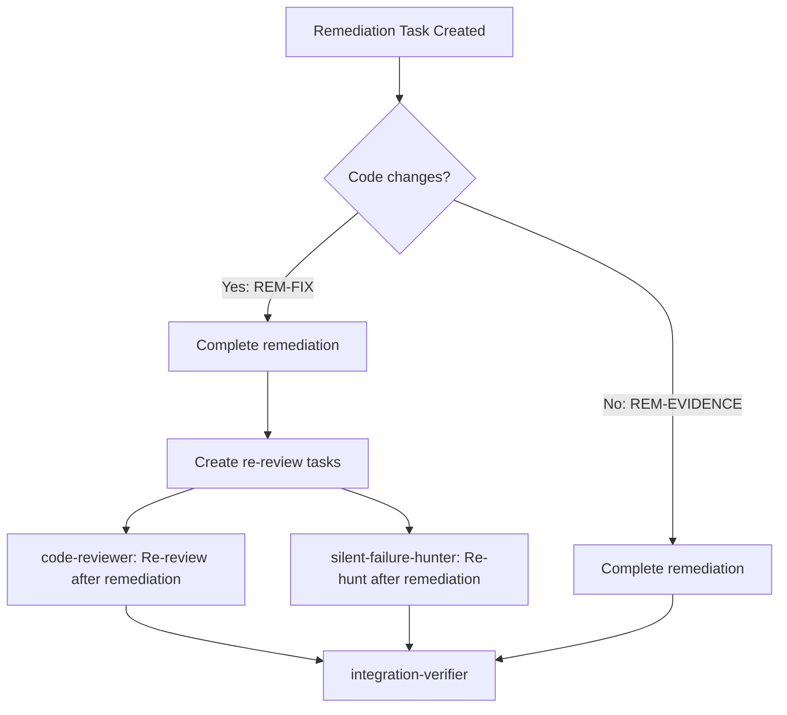

# CC10x Orchestration Bible (Plugin-Only Source of Truth)

> **Last synced with agents/skills:** 2026-02-05 (post-SKILL_HINTS fix) | **Status:** IN SYNC

> This document is derived **only** from `plugins/cc10x/` (agents + skills).
> Ignore all other docs. Do not trust external narratives.

---

## Purpose

The orchestration layer is the system. If orchestration breaks, CC10x breaks.
This document defines the **non-negotiable** routing, tasking, agent chaining, and memory protocols that MUST remain intact.

---

## Glossary (Plugin Terms)

- **Router**: The execution engine defined by `plugins/cc10x/skills/cc10x-router/SKILL.md`.
- **Workflow**: One of BUILD, DEBUG, REVIEW, PLAN.
- **Agents**: `component-builder`, `bug-investigator`, `code-reviewer`, `silent-failure-hunter`, `integration-verifier`, `planner`.
- **Skills**: Specialized rulebooks in `plugins/cc10x/skills/*/SKILL.md`.
- **Memory**: `.claude/cc10x/{activeContext.md, patterns.md, progress.md}`.
- **Router Contract**: Machine-readable YAML section in agent output for validation.
- **Dev Journal**: User transparency section in agent output (narrative of what was done).

---

## Skills vs Agents (Claude Code Concepts)

> This section documents the Claude Code platform concepts that CC10x is built on.
> Source: Claude Code official documentation. This is reference for maintainers.

### What is a Skill?

A **skill** is a Markdown file (`SKILL.md`) with optional YAML frontmatter. It provides instructions, reference material, or task workflows that teach Claude how to do something. Skills do NOT execute — they INSTRUCT.

**Skill frontmatter fields:**
```yaml
name: skill-name          # Identifier (lowercase, hyphens)
description: "..."        # When Claude should use this skill
allowed-tools: Read, Grep # Tools that skip permission prompts when skill is active
```

**Key facts:**
- `allowed-tools` is **NOT runtime enforcement**. It defines which tools skip permission prompts. The agent's `tools:` field controls actual tool availability.
- Skills are loaded as text context — injected into the agent's system prompt.
- Skills cannot call tools themselves. They instruct the hosting agent to call tools.

### What is an Agent?

An **agent** is a Markdown file with YAML frontmatter that defines an isolated subprocess. When invoked via `Task(subagent_type="...")`, Claude Code spawns a new process with its own context window, tools, and instructions.

**Agent frontmatter fields:**
```yaml
name: agent-name          # Identifier
tools: Read, Edit, Bash   # Actual tool allowlist (enforced at runtime)
skills: skill-a, skill-b  # Skills to preload (full content injected at startup)
context: fork             # Run in isolated subprocess (cannot see parent conversation)
model: inherit            # Model to use
```

**Key facts:**
- `tools:` is the **actual runtime allowlist**. Agent can ONLY use tools listed here.
- `skills:` preloads full skill content into the agent's system prompt at startup. Agent does NOT need to call `Skill()` for preloaded skills.
- `context: fork` means the agent runs in a fresh context. It cannot see the parent conversation, CLAUDE.md, or other agents' outputs.
- Agent outputs are returned to the caller (router) as a single result.

### Skills vs Agents — The Distinction

| Aspect | Skill | Agent |
|--------|-------|-------|
| **Nature** | Instructions (text) | Execution unit (subprocess) |
| **Runs as** | Context injected into an agent | Isolated process with own context window |
| **Can use tools?** | No — instructs the hosting agent to use tools | Yes — has its own `tools:` allowlist |
| **Can see parent context?** | Only if loaded into parent; forked agents cannot see parent | No (`context: fork`) |
| **Loaded via** | Agent frontmatter `skills:` (automatic) or `Skill()` call (on-demand) | `Task(subagent_type="...")` |
| **Frontmatter tool field** | `allowed-tools` (permission hint, NOT enforcement) | `tools` (actual allowlist, enforced) |

### How CC10x Uses This Architecture

**6 Agents (execution units):**
- `component-builder` — Builds features (has Edit, Write, Bash)
- `bug-investigator` — Debugs issues (has Edit, Write, Bash)
- `planner` — Creates plans (has Edit, Write, Bash for plan files + memory only)
- `code-reviewer` — Reviews code (READ-ONLY: no Edit, no Write)
- `silent-failure-hunter` — Finds silent failures (READ-ONLY: no Edit, no Write)
- `integration-verifier` — Verifies E2E (READ-ONLY: no Edit, no Write)

**12 Skills (instruction sets loaded into agents):**
- `cc10x-router` — Orchestration engine (loaded by main Claude, not agents)
- `session-memory` — Memory protocol (WRITE agents only)
- `code-generation` — Code writing patterns (component-builder)
- `test-driven-development` — TDD protocol (component-builder, bug-investigator)
- `debugging-patterns` — Debug methodology (bug-investigator, integration-verifier)
- `code-review-patterns` — Review methodology (code-reviewer, silent-failure-hunter)
- `verification-before-completion` — Verification gates (4 agents)
- `planning-patterns` — Plan writing (planner)
- `brainstorming` — Idea exploration (planner)
- `architecture-patterns` — Architecture design (5 agents)
- `frontend-patterns` — Frontend patterns (all 6 agents)
- `github-research` — External research (conditional via SKILL_HINTS)

**Why this separation:**
1. **Skills are reusable** — `architecture-patterns` loads into 5 different agents. One source of truth for architecture rules.
2. **Agents are isolated** — code-reviewer cannot accidentally edit files because its `tools:` field excludes Edit/Write. This is enforced by Claude Code, not by English instruction.
3. **Skills compose** — An agent's behavior is the combination of its base instructions + all preloaded skills. Adding a skill to an agent's frontmatter changes its behavior without modifying the agent file.
4. **SKILL_HINTS bridge the gap** — Forked agents cannot see CLAUDE.md. The router (running in main context) reads CLAUDE.md, detects matching complementary skills, and passes them via SKILL_HINTS in the agent's prompt. The agent then calls `Skill()` on demand.

### External Skill Conflict Risk (Design Decision)

Claude Code auto-loads descriptions of ALL installed skills (global + project + plugins) into the main context. External skills with broad trigger descriptions can conflict with CC10x routing — Claude might invoke them instead of or alongside the router. **CLAUDE.md's Complementary Skills table is the ONLY approved channel for external skills.** It ensures the user has explicitly vetted compatibility. Do not implement auto-discovery of installed skills.

---

## Orchestration Invariants (Never Break)

1. **Router is the ONLY entry point.** Every development task must pass through it.
2. **Memory load is mandatory before any decision.**
3. **Task-based orchestration is mandatory.** All workflows use tasks with dependencies.
4. **Workflow selection uses the decision tree in priority order.**
5. **Agent chain must complete.** No workflow is done until its chain is complete.
6. **Parallel execution must be in a single message.**
7. **Research is prerequisite if triggered, and MUST be persisted.**
8. **Memory must be updated at the end of a workflow.**

---

## Decision Tree (Routing)

Priority order (highest wins):

1. **ERROR** → DEBUG
   Keywords: error, bug, fix, broken, crash, fail, debug, troubleshoot, issue, problem, doesn't work
2. **PLAN** → PLAN
   Keywords: plan, design, architect, roadmap, strategy, spec, "before we build", "how should we"
3. **REVIEW** → REVIEW
   Keywords: review, audit, check, analyze, assess, "what do you think", "is this good"
4. **DEFAULT** → BUILD

Conflict rule: **ERROR always wins** (e.g., “fix the build” = DEBUG).

---

## High-Level Orchestration Diagram



---

## Task-Based Orchestration (Mandatory)

### Task Hierarchies (Canonical)

**BUILD**
- Parent: `CC10X BUILD: {feature_summary}`
- Agents:
  - `component-builder` (no dependencies)
  - `code-reviewer` (blocked by component-builder)
  - `silent-failure-hunter` (blocked by component-builder)
  - `integration-verifier` (blocked by reviewer + hunter)
  - `Memory Update` (blocked by integration-verifier) ← TASK-ENFORCED

**DEBUG**
- Parent: `CC10X DEBUG: {error_summary}`
- Agents:
  - `bug-investigator`
  - `code-reviewer` (blocked by bug-investigator)
  - `integration-verifier` (blocked by code-reviewer)
  - `Memory Update` (blocked by integration-verifier) ← TASK-ENFORCED

**REVIEW**
- Parent: `CC10X REVIEW: {target_summary}`
- Agent: `code-reviewer`
- `Memory Update` (blocked by code-reviewer) ← TASK-ENFORCED

**PLAN**
- Parent: `CC10X PLAN: {feature_summary}`
- Agent: `planner`
- `Memory Update` (blocked by planner) ← TASK-ENFORCED

### Task Execution Loop (Required)

1. `TaskList()` → find tasks with `status=pending` and no blockers.
2. `TaskUpdate({ taskId, status: "in_progress" })`
3. Run agent(s). If more than one is ready, **invoke in the same message** (parallel).
4. After agent returns, router calls `TaskUpdate({ taskId, status: "completed" })`.
5. Repeat until **ALL** agent tasks are completed.

**Note:** Agents do NOT call TaskUpdate for their own task. Router owns task status transitions (Task() return is the deterministic handoff point).

### Tasks Tool Contract (Keep Examples Exact)

CC10x orchestration relies on Claude Code Tasks. Keep every example aligned with the tool schema:

- `TaskCreate({ subject, description, activeForm })`
- `TaskUpdate({ taskId, status, addBlockedBy, addBlocks })` where `status ∈ pending|in_progress|completed|deleted`
- `TaskList()`, `TaskGet({ taskId })`

**Do not rely on non-standard fields (e.g., `metadata`) unless verified in the runtime.**
If extra context is needed (plan file, repo scope, agent name), put it in `subject` / `description` so it is always available via `TaskList` / `TaskGet`.

---

## Agent Chain Protocols

### BUILD Chain (Strict)



**Parallel rule:** code-reviewer + silent-failure-hunter must be invoked **together**.
**Do not run integration-verifier until BOTH complete.**

### DEBUG Chain
`bug-investigator → code-reviewer → integration-verifier`

### REVIEW Chain
`code-reviewer` only

### PLAN Chain
`planner` only

---

## Memory Protocol (Required)

### Load (Before Routing)

**Step 1 (MUST complete first):**
```
mkdir -p .claude/cc10x
```

**Step 2 (AFTER Step 1):**
```
Read .claude/cc10x/activeContext.md
Read .claude/cc10x/patterns.md
Read .claude/cc10x/progress.md
```

**Do NOT parallelize Step 1 and Step 2.**

### Update (After Workflow)

**WRITE agents** (component-builder, bug-investigator, planner):
- Update memory directly using `Edit(...)` + `Read(...)` verify pattern
- Have session-memory skill for full protocol

**READ-ONLY agents** (code-reviewer, silent-failure-hunter, integration-verifier):
- Do NOT have Edit tool - cannot update memory directly
- Output `### Memory Notes (For Workflow-Final Persistence)` section
- Memory Notes persisted via task-enforced "CC10X Memory Update" task

**Memory load + update are non-negotiable.**

**Parallel safety (BUILD only):**
- During the parallel phase (`code-reviewer ∥ silent-failure-hunter`), **neither agent updates memory**.
- Both are READ-ONLY and output Memory Notes sections.
- Memory Update task persists all Memory Notes **after** all agents complete (task-enforced).

**Workflow-Final Memory Persistence (Task-Enforced):**
- Each workflow has a "CC10X Memory Update" task blocked by the final agent
- When this task becomes available, collect Memory Notes and persist:
  1. Learnings to `activeContext.md ## Learnings`
  2. Patterns/gotchas to `patterns.md ## Common Gotchas`
  3. Verification evidence to `progress.md ## Verification`
- Task-enforced ensures persistence survives context compaction

**Memory contract (never break anchors):**
- Do not rename the top-level headers or section headers in `.claude/cc10x/*.md`.
- After any `Edit(...)`, `Read(...)` back and confirm the intended change exists. If not, STOP and retry with a correct `old_string` anchor.

### Template Validation Gate (Auto-Heal)

After loading memory files, the router MUST ensure all required sections exist. This prevents `Edit` failures on projects with older/incomplete memory templates.

**Required sections by file:**

| File | Required Sections |
|------|-------------------|
| `activeContext.md` | `## Current Focus`, `## Recent Changes`, `## Next Steps`, `## Decisions`, `## Learnings`, `## References`, `## Blockers`, `## Last Updated` |
| `progress.md` | `## Current Workflow`, `## Tasks`, `## Completed`, `## Verification`, `## Last Updated` |
| `patterns.md` | `## Common Gotchas` (minimum) |

**Auto-heal pattern:**
```
# If any section missing, insert before ## Last Updated:
Edit(file_path=".claude/cc10x/activeContext.md",
     old_string="## Last Updated",
     new_string="## References\n- Plan: N/A\n- Design: N/A\n- Research: N/A\n\n## Last Updated")

# VERIFY after each heal
Read(file_path=".claude/cc10x/activeContext.md")
```

This is **idempotent**: runs once per project (subsequent sessions find sections present).

**Why this exists:** v6.0.4+ uses stable section anchors. Old projects may lack these sections, causing Edit failures. Auto-heal ensures backward compatibility.

---

## Research Protocol (Only When Triggered)

Trigger conditions (any one):
- User explicitly requests research (github/best practices/etc).
- Post-2024 tech or unfamiliar integration.
- External service error or 3+ failed debug attempts.

Mandatory steps:
1. Execute research using octocode tools.
2. Persist to `docs/research/YYYY-MM-DD-<topic>-research.md`.
3. Update `activeContext.md` with research reference.
4. If gotchas found, append to `patterns.md`.

**Research is a prerequisite; do not invoke planner/bug-investigator before it’s saved.**

---

## Skill Loading Hierarchy (Definitive)

### Mechanism 1: Agent Frontmatter `skills:` (PRIMARY - Automatic)

All CC10x internal skills listed below load automatically via agent frontmatter. No `Skill()` calls needed for these. (Conditional skills use Mechanism 2 below.)

| Agent | Frontmatter Skills |
|-------|-------------------|
| component-builder | session-memory, test-driven-development, code-generation, verification-before-completion, frontend-patterns, architecture-patterns |
| code-reviewer | code-review-patterns, verification-before-completion, frontend-patterns, architecture-patterns |
| silent-failure-hunter | code-review-patterns, verification-before-completion, frontend-patterns, architecture-patterns |
| integration-verifier | architecture-patterns, debugging-patterns, verification-before-completion, frontend-patterns |
| bug-investigator | session-memory, debugging-patterns, test-driven-development, verification-before-completion, architecture-patterns, frontend-patterns |
| planner | session-memory, planning-patterns, architecture-patterns, brainstorming, frontend-patterns |

### Mechanism 2: Conditional `Skill()` Call (Router SKILL_HINTS)

Router passes SKILL_HINTS in agent prompt. Agent invokes via `Skill(skill="{name}")`.

**Sources for SKILL_HINTS:**
1. **Router detection table** - github-research triggers (explicit request, post-2024 tech, 3+ debug failures)
2. **CLAUDE.md Complementary Skills table** - user-configured domain skills (react-best-practices, mongodb-agent-skills, etc.)

**Critical flow:**
- Router runs in main Claude context → can see CLAUDE.md
- Subagents are forked → cannot see CLAUDE.md
- Router bridges the gap: reads CLAUDE.md → passes to agents via SKILL_HINTS

**All 6 agents have `## SKILL_HINTS (If Present)` section** instructing them to invoke skills after memory load.

**Why conditional:** Not always needed; avoids context bloat when irrelevant.

---

## Agent Output Requirements (Validation Gate)

### Standard Agent Output Format (All Agents)

All agents must output these sections:

```markdown
## {Action}: {summary}

### Dev Journal (User Transparency)
**What I Did:** [Narrative of actions taken]
**Key Decisions Made:** [Decisions + WHY]
**Alternatives Considered:** [What was rejected + reason]
**Where Your Input Helps:** [Decision points, assumptions to validate]
**What's Next:** [What user should expect from next phase]

### {Agent-Specific Results}
[TDD Evidence, Review Findings, Hunt Results, etc.]

### Task Status
- Task {TASK_ID}: COMPLETED

### Router Contract (MACHINE-READABLE)
```yaml
STATUS: [PASS|FAIL|APPROVE|CHANGES_REQUESTED|CLEAN|ISSUES_FOUND|FIXED|PLAN_CREATED]
CONFIDENCE: [0-100]
CRITICAL_ISSUES: [count]
BLOCKING: [true|false]
REQUIRES_REMEDIATION: [true|false]
REMEDIATION_REASON: [null or exact text for REM-FIX task]
MEMORY_NOTES:
  learnings: ["..."]
  patterns: ["..."]
  verification: ["..."]
```
**CONTRACT RULE:** [Agent-specific validation criteria]
```

### Router Contract by Agent

| Agent | STATUS Values | BLOCKING when | Key Contract Fields |
|-------|---------------|---------------|---------------------|
| component-builder | PASS, FAIL | TDD evidence missing | TDD_RED_EXIT, TDD_GREEN_EXIT |
| code-reviewer | APPROVE, CHANGES_REQUESTED | CRITICAL_ISSUES > 0 | CONFIDENCE, CRITICAL_ISSUES |
| silent-failure-hunter | CLEAN, ISSUES_FOUND | CRITICAL_ISSUES > 0 | CRITICAL_ISSUES |
| integration-verifier | PASS, FAIL | BLOCKERS > 0 | SCENARIOS_PASSED, BLOCKERS |
| bug-investigator | FIXED, INVESTIGATING, BLOCKED | STATUS != FIXED | ROOT_CAUSE, VARIANTS_COVERED |
| planner | PLAN_CREATED, NEEDS_CLARIFICATION | Never | PLAN_FILE, PHASES, CONFIDENCE |

### Post-Agent Validation Logic (Router Contract-Based)

Router validates agent output using the Router Contract:

```
Step 1: Check for Router Contract
- Look for "### Router Contract (MACHINE-READABLE)" section
- If NOT found → Create REM-EVIDENCE task, block downstream, STOP

Step 2: Parse and Validate Contract
- Parse YAML block

Circuit Breaker (BEFORE creating any REM-FIX):
- If 3+ REM-FIX tasks already exist → AskUserQuestion:
  - Research best practices (Recommended)
  - Fix locally
  - Skip (not recommended)
  - Abort

Validation Rules:
1. If contract.BLOCKING == true OR contract.REQUIRES_REMEDIATION == true:
   → Create REM-FIX task using contract.REMEDIATION_REASON
   → Block downstream tasks via TaskUpdate({ addBlockedBy })
   → STOP

2. If contract.CRITICAL_ISSUES > 0 AND parallel phase:
   → Conflict check: reviewer APPROVE vs hunter CRITICAL
   → AskUserQuestion to resolve if conflict
   → Otherwise treat as blocking

3. Collect contract.MEMORY_NOTES for workflow-final persistence

4. If none of above triggered → Proceed to next agent

Step 3: Output Validation Evidence
### Agent Validation: {agent_name}
- Router Contract: Found
- STATUS: {contract.STATUS}
- BLOCKING: {contract.BLOCKING}
- CRITICAL_ISSUES: {contract.CRITICAL_ISSUES}
- Proceeding: [Yes/No + reason]
```

### Task Types and Prefixes

| Type | Subject Prefix | Created By | Purpose | Auto-Execute? |
|------|---------------|------------|---------|---------------|
| Workflow | `CC10X BUILD:` / `DEBUG:` / etc. | Router | Parent workflow task | N/A |
| Agent | `CC10X {agent}:` | Router | Agent work item | Yes |
| Evidence-only | `CC10X REM-EVIDENCE:` | Router | Re-run commands for missing evidence | Yes |
| Code changes | `CC10X REM-FIX:` | Router | Fix issues found by reviewer/hunter | Yes (triggers re-review) |
| Follow-up | `CC10X TODO:` | Agents | Non-blocking discoveries for user action | **No** (user decides) |

### Remediation Re-Review Loop (BUILD - Non-Negotiable)

When any `CC10X REM-FIX:` task is created (code/test changes required), the following re-review loop is **mandatory**:



**Implementation:**
1. After `CC10X REM-FIX:` task completes, create two re-review tasks:
   - `CC10X code-reviewer: Re-review after remediation`
   - `CC10X silent-failure-hunter: Re-hunt after remediation`

2. Block `integration-verifier` on BOTH re-review tasks:
   ```
   TaskUpdate({ taskId: verifier_task_id, addBlockedBy: [re_reviewer_id, re_hunter_id] })
   ```

3. Only proceed to `integration-verifier` after re-review tasks complete.

**Why this is non-negotiable:** Without re-review, code changes made during remediation ship without review - the heart of orchestration integrity is broken.

---

## Agent Invocation Template (Required)

The router must pass task ID and context to each agent:

```
Task(subagent_type="cc10x:component-builder", prompt="
## Task Context
- Task ID: {taskId}
- Plan File: {planFile or 'None'}

## User Request
{request}

## Requirements
{AskUserQuestion results or 'See plan file'}

## Memory Summary
{activeContext summary}

## Project Patterns
{patterns summary}

## SKILL_HINTS (conditional skills if triggered)
{detected skills from router detection table + CLAUDE.md, otherwise "None"}
**If skills listed:** Call `Skill(skill="{skill-name}")` after memory load. If unavailable, note in Memory Notes and continue.

---
IMPORTANT:
- Include Dev Journal section for user transparency
- Include Router Contract section (YAML) for validation
- WRITE agents: Update memory using Edit() at task end
- READ-ONLY agents: Include Memory Notes in Router Contract
")
```

**Task ID is required in prompt.** Router updates task status after agent returns (agents do NOT call TaskUpdate for their own task).

**Router Contract:** All agents must include `### Router Contract (MACHINE-READABLE)` with YAML block. Router uses contract for validation decisions.

**Dev Journal:** All agents must include `### Dev Journal (User Transparency)` with narrative of what was done, decisions made, and where user input helps.

---

## Critical Gating Checklist

1. MEMORY_LOADED
2. TASKS_CHECKED (TaskList)
3. INTENT_CLARIFIED
4. RESEARCH_EXECUTED (if triggered)
5. RESEARCH_PERSISTED (if triggered)
6. REQUIREMENTS_CLARIFIED (BUILD only)
7. TASKS_CREATED
8. ALL_TASKS_COMPLETED
9. MEMORY_UPDATED

---

## Non-Optional Behaviors (Hard Rules)

- **Never stop after one agent.** Complete the workflow chain.
- **Never claim completion without verification evidence.**
- **No production code without failing test first (TDD).**
- **No architecture/plan/design before flows are mapped.**

---

## Task State Transitions (Non-Negotiable)

```
┌─────────┐       ┌─────────────┐       ┌───────────┐
│ pending │──────►│ in_progress │──────►│ completed │
└─────────┘       └─────────────┘       └───────────┘
     │                   │
     │                   │
     └───────────────────┴──────────► deleted
```

**State Transitions:**
- `pending` → `in_progress`: When agent starts work
- `in_progress` → `completed`: When agent finishes
- Any → `deleted`: When task removed

**A task is available when:**
- status = `pending`
- blockedBy list is empty (all dependencies resolved)

**Blocked Tasks:**
- Task with non-empty `blockedBy` cannot become `in_progress`
- When blocking task completes, blocked task automatically becomes available

---

## Final Reminder

This Bible is the contract.
Any change to routing, task orchestration, parallel execution, or memory gates **must be evaluated against this doc first**.
