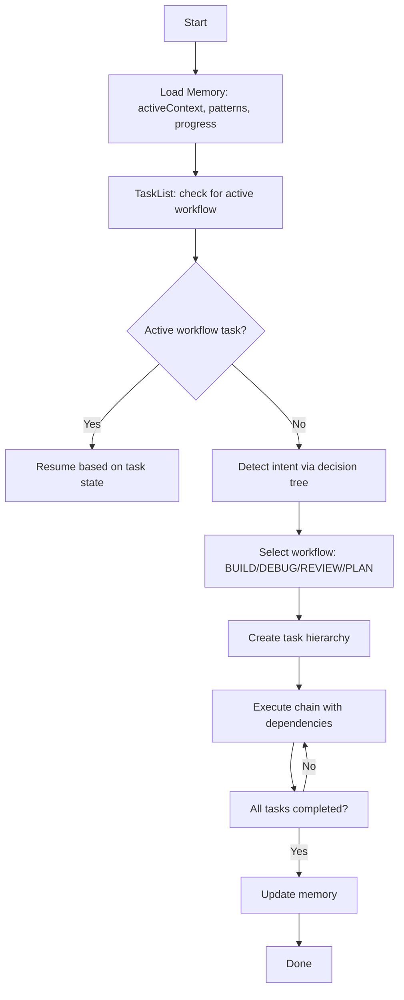
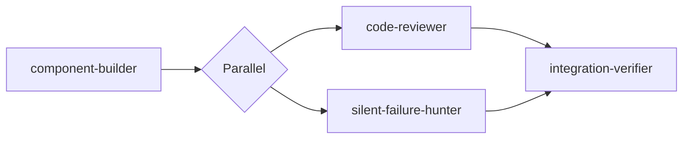
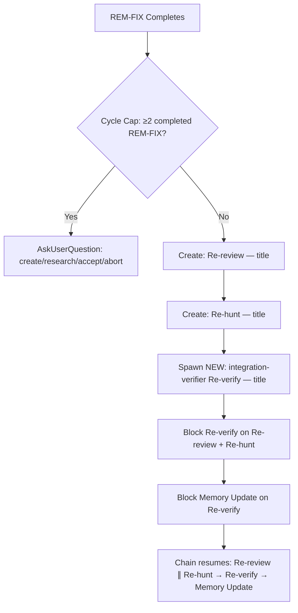

# CC10x Orchestration Bible (Plugin-Only Source of Truth)

> **Last synced with agents/skills:** 2026-03-04 (v8.0.0 — Radical Simplification: removed Router Contract YAML from read-only agents (code-reviewer, silent-failure-hunter, integration-verifier); text-based verdict extraction via agent heading; JUST_GO session mode; Empty Answer Guard simplified to REVERT-only blocking; REM-EVIDENCE loop eliminated; ~280 lines removed) | **Status:** IN SYNC

> This document is derived **only** from `plugins/cc10x/` (agents + skills).
> Ignore all other docs. Do not trust external narratives.

---

## Purpose

The orchestration layer is the system. If orchestration breaks, CC10x breaks.
This document defines the **non-negotiable** routing, tasking, agent chaining, and memory protocols that MUST remain intact.

---

## Glossary (Plugin Terms)

- **Router**: The execution engine defined by `plugins/cc10x/skills/cc10x-router/SKILL.md`.
- **Workflow**: One of BUILD, DEBUG, REVIEW, PLAN.
- **Agents**: `component-builder`, `bug-investigator`, `code-reviewer`, `silent-failure-hunter`, `integration-verifier`, `planner`, `web-researcher`, `github-researcher`.
- **Skills**: Specialized rulebooks in `plugins/cc10x/skills/*/SKILL.md`.
- **Memory**: `.claude/cc10x/{activeContext.md, patterns.md, progress.md}`.
- **Router Contract**: Machine-readable output signal used by the router for validation. **Two-track since v8.0.0:** WRITE agents (component-builder, bug-investigator, planner) still emit `### Router Contract (MACHINE-READABLE)` YAML blocks. READ-ONLY agents (code-reviewer, silent-failure-hunter, integration-verifier) use text-based heading extraction — the heading (`## Review: Approve/Changes Requested`, `## Error Handling Audit: CLEAN/ISSUES_FOUND`, `## Verification: PASS/FAIL`) IS the contract.
- **Dev Journal**: User transparency section in WRITE agent output only (narrative of what was done). Removed from READ-ONLY agents in v8.0.0 to reduce token pressure.

---

## Skills vs Agents (Claude Code Concepts)

> This section documents the Claude Code platform concepts that CC10x is built on.
> Source: Claude Code official documentation. This is reference for maintainers.

### What is a Skill?

A **skill** is a Markdown file (`SKILL.md`) with optional YAML frontmatter. It provides instructions, reference material, or task workflows that teach Claude how to do something. Skills do NOT execute — they INSTRUCT.

**Skill frontmatter fields:**
```yaml
name: skill-name          # Identifier (lowercase, hyphens)
description: "..."        # When Claude should use this skill
allowed-tools: Read, Grep # Tools that skip permission prompts when skill is active
```

**Key facts:**
- `allowed-tools` is **NOT runtime enforcement**. It defines which tools skip permission prompts. The agent's `tools:` field controls actual tool availability.
- Skills are loaded as text context — injected into the agent's system prompt.
- Skills cannot call tools themselves. They instruct the hosting agent to call tools.

### What is an Agent?

An **agent** is a Markdown file with YAML frontmatter that defines an isolated subprocess. When invoked via `Task(subagent_type="...")`, Claude Code spawns a new process with its own context window, tools, and instructions.

**Agent frontmatter fields:**
```yaml
name: agent-name          # Identifier
tools: Read, Edit, Bash   # Actual tool allowlist (enforced at runtime)
skills: skill-a, skill-b  # Skills to preload (full content injected at startup)
model: inherit            # Model to use
```

**Key facts:**
- `tools:` is the **actual runtime allowlist**. Agent can ONLY use tools listed here.
- `skills:` preloads full skill content into the agent's system prompt at startup. Agent does NOT need to call `Skill()` for preloaded skills.
- Agent outputs are returned to the caller (router) as a single result.

Agents spawned via Task() run in isolated context windows by default — they cannot see the parent conversation, CLAUDE.md, or other agents' outputs. No frontmatter configuration is required for isolation.

### Skills vs Agents — The Distinction

| Aspect | Skill | Agent |
|--------|-------|-------|
| **Nature** | Instructions (text) | Execution unit (subprocess) |
| **Runs as** | Context injected into an agent | Isolated process with own context window |
| **Can use tools?** | No — instructs the hosting agent to use tools | Yes — has its own `tools:` allowlist |
| **Can see parent context?** | Only if loaded into parent; forked agents cannot see parent | No (isolated by default) |
| **Loaded via** | Agent frontmatter `skills:` (automatic) or `Skill()` call (on-demand) | `Task(subagent_type="...")` |
| **Frontmatter tool field** | `allowed-tools` (permission hint, NOT enforcement) | `tools` (actual allowlist, enforced) |

### How CC10x Uses This Architecture

**8 Agents (execution units):**
- `component-builder` — Builds features (has Edit, Write, Bash)
- `bug-investigator` — Debugs issues (has Edit, Write, Bash)
- `planner` — Creates plans (has Edit, Write, Bash for plan files + memory only)
- `code-reviewer` — Reviews code (READ-ONLY: no Edit, no Write)
- `silent-failure-hunter` — Finds silent failures (READ-ONLY: no Edit, no Write)
- `integration-verifier` — Verifies E2E (READ-ONLY: no Edit, no Write)
- `web-researcher` — Executes web research (Bright Data + WebSearch); spawned by router in parallel
- `github-researcher` — Executes GitHub research (Octocode MCP); spawned by router in parallel

**12 Skills (instruction sets loaded into agents):**
- `cc10x-router` — Orchestration engine (loaded by main Claude, not agents)
- `session-memory` — Memory protocol (WRITE agents only)
- `code-generation` — Code writing patterns (component-builder)
- `test-driven-development` — TDD protocol (component-builder, bug-investigator)
- `debugging-patterns` — Debug methodology (bug-investigator only — removed from integration-verifier in v6.0.29)
- `code-review-patterns` — Review methodology (code-reviewer, silent-failure-hunter)
- `verification-before-completion` — Verification gates (4 agents)
- `planning-patterns` — Plan writing (planner)
- `brainstorming` — Idea exploration (router PLAN workflow in main context — NOT planner frontmatter)
- `architecture-patterns` — Architecture design (all 6 agents)
- `frontend-patterns` — Frontend patterns (all 6 agents)
- `research` — Synthesis guidance (passed as SKILL_HINTS to planner/bug-investigator when parallel research files are available — NOT router-executed inline)

### Research Architecture

Research runs as parallel agents spawned directly by the router (same pattern as `code-reviewer ∥ silent-failure-hunter`):

```
Router detects research need
  → Task(cc10x:web-researcher) [parallel]   → docs/research/{date}-{topic}-web.md
  → Task(cc10x:github-researcher) [parallel] → docs/research/{date}-{topic}-github.md
  Both complete → router collects both FILE_PATHs
  → Router passes both paths to planner or bug-investigator
```

The `cc10x:research` skill provides synthesis guidance (loaded via SKILL_HINTS by planner/bug-investigator).
The router never executes research inline.

**Why this separation:**
1. **Skills are reusable** — `architecture-patterns` loads into 5 different agents. One source of truth for architecture rules.
2. **Agents are isolated** — code-reviewer cannot accidentally edit files because its `tools:` field excludes Edit/Write. This is enforced by Claude Code, not by English instruction.
3. **Skills compose** — An agent's behavior is the combination of its base instructions + all preloaded skills. Adding a skill to an agent's frontmatter changes its behavior without modifying the agent file.
4. **SKILL_HINTS bridge the gap** — Forked agents cannot see CLAUDE.md. The router (running in main context) reads CLAUDE.md, detects matching complementary skills, and passes them via SKILL_HINTS in the agent's prompt. The agent then calls `Skill()` on demand.

### External Skill Conflict Risk (Design Decision)

Claude Code auto-loads descriptions of ALL installed skills (global + project + plugins) into the main context. External skills with broad trigger descriptions can conflict with CC10x routing — Claude might invoke them instead of or alongside the router. **CLAUDE.md's Complementary Skills table is the ONLY approved channel for external skills.** It ensures the user has explicitly vetted compatibility. Do not implement auto-discovery of installed skills.

---

## Orchestration Invariants (Never Break)

1. **Router is the ONLY entry point.** Every development task must pass through it.
2. **Memory load is mandatory before any decision.**
3. **Task-based orchestration is mandatory.** All workflows use tasks with dependencies.
4. **Workflow selection uses the decision tree in priority order.**
5. **Agent chain must complete.** No workflow is done until its chain is complete.
6. **Parallel execution must be in a single message.**
7. **Research is prerequisite if triggered, and MUST be persisted.**
8. **Memory must be updated at the end of a workflow.**

---

## Decision Tree (Routing)

Priority order (highest wins):

1. **ERROR** → DEBUG
   Keywords: error, bug, fix, broken, crash, fail, debug, troubleshoot, issue, problem, doesn't work
2. **PLAN** → PLAN
   Keywords: plan, design, architect, roadmap, strategy, spec, "before we build", "how should we"
3. **REVIEW** → REVIEW
   Keywords: review, audit, check, analyze, assess, "what do you think", "is this good"
4. **DEFAULT** → BUILD

Conflict rule: **ERROR always wins** (e.g., “fix the build” = DEBUG).

---

## High-Level Orchestration Diagram


```mermaid
flowchart TD
  A[Start] --> B[Load Memory: activeContext, patterns, progress]
  B --> C[TaskList: check for active workflow]
  C --> D{Active workflow task?}
  D -->|Yes| E[Resume based on task state]
  D -->|No| F[Detect intent via decision tree]
  F --> G[Select workflow: BUILD/DEBUG/REVIEW/PLAN]
  G --> H[Create task hierarchy]
  H --> I[Execute chain with dependencies]
  I --> J[All tasks completed?]
  J -->|No| I
  J -->|Yes| K[Update memory]
  K --> L[Done]
```

---

## Task-Based Orchestration (Mandatory)

### Task Hierarchies (Canonical)

**BUILD**
- Parent: `CC10X BUILD: {feature_summary}`
- Agents:
  - `component-builder` (no dependencies)
  - `code-reviewer` (blocked by component-builder)
  - `silent-failure-hunter` (blocked by component-builder)
  - `integration-verifier` (blocked by reviewer + hunter)
  - `Memory Update` (blocked by integration-verifier) ← TASK-ENFORCED

**DEBUG**
- Parent: `CC10X DEBUG: {error_summary}`
- Agents:
  - `bug-investigator`
  - `code-reviewer` (blocked by bug-investigator)
  - `integration-verifier` (blocked by code-reviewer)
  - `Memory Update` (blocked by integration-verifier) ← TASK-ENFORCED

**REVIEW**
- Parent: `CC10X REVIEW: {target_summary}`
- Agent: `code-reviewer`
- `Memory Update` (blocked by code-reviewer) ← TASK-ENFORCED

**PLAN**
- Parent: `CC10X PLAN: {feature_summary}`
- Agent: `planner`
- `Memory Update` (blocked by planner) ← TASK-ENFORCED

### Task Execution Loop (Required)

1. `TaskList()` → find tasks with `status=pending` and no blockers.
2. `TaskUpdate({ taskId, status: "in_progress" })`
3. Run agent(s). If more than one is ready, **invoke in the same message** (parallel).
4. Agent self-reports: calls `TaskUpdate({ taskId, status: "completed" })` in its final output. Router validates via `TaskList()` and calls `TaskUpdate` as fallback if status is still `in_progress`.
5. Repeat until **ALL** agent tasks are completed.

**Note (v6.0.29+):** Agents DO call TaskUpdate for their own task (self-completion). Router applies a fallback if the agent missed it. Both are defense-in-depth — not a contradiction. `Task()` return is the deterministic handoff point for the router to validate.

### Tasks Tool Contract (Keep Examples Exact)

CC10x orchestration relies on Claude Code Tasks. Keep every example aligned with the tool schema:

- `TaskCreate({ subject, description, activeForm })`
- `TaskUpdate({ taskId, status, description, subject, activeForm, owner, addBlockedBy, addBlocks })` where `status ∈ pending|in_progress|completed|deleted`
- `TaskList()`, `TaskGet({ taskId })`

**Do not rely on non-standard fields (e.g., `metadata`) unless verified in the runtime.**
If extra context is needed (plan file, repo scope, agent name), put it in `subject` / `description` so it is always available via `TaskList` / `TaskGet`.
`description` field is supported and used by the router's step 3a to capture Memory Notes (compaction-safe).

---

## Agent Chain Protocols

### BUILD Chain (Strict)


```mermaid
flowchart LR
  A[component-builder] --> B{Parallel}
  B --> C[code-reviewer]
  B --> D[silent-failure-hunter]
  C --> E[integration-verifier]
  D --> E
```

**Parallel rule:** code-reviewer + silent-failure-hunter must be invoked **together**.
**Do not run integration-verifier until BOTH complete.**

### DEBUG Chain
`bug-investigator → code-reviewer → integration-verifier`

### REVIEW Chain
`code-reviewer` only

### PLAN Chain
`planner` — runs plan-review-gate inline after saving plan (Skill() call inside planner; inline self-review: Feasibility, Completeness, Scope checks using planner's own tools)

**Note:** plan-review-gate runs inside the planner agent's context — not a separate router step. BUILD/DEBUG/REVIEW chains are unaffected.

---

## Memory Protocol (Required)

### Load (Before Routing)

**Step 1 (MUST complete first):**
```
mkdir -p .claude/cc10x
```

**Step 2 (AFTER Step 1):**
```
Read .claude/cc10x/activeContext.md
Read .claude/cc10x/patterns.md
Read .claude/cc10x/progress.md
```

**Do NOT parallelize Step 1 and Step 2.**

### Update (After Workflow)

**WRITE agents** (component-builder, bug-investigator, planner):
- Update memory directly using `Edit(...)` + `Read(...)` verify pattern
- Have session-memory skill for full protocol

**READ-ONLY agents** (code-reviewer, silent-failure-hunter, integration-verifier):
- Do NOT have Edit tool - cannot update memory directly
- Output `### Memory Notes (For Workflow-Final Persistence)` section
- Memory Notes persisted via task-enforced "CC10X Memory Update" task

**Memory load + update are non-negotiable.**

**Parallel safety (BUILD only):**
- During the parallel phase (`code-reviewer ∥ silent-failure-hunter`), **neither agent updates memory**.
- Both are READ-ONLY and output Memory Notes sections.
- Memory Update task persists all Memory Notes **after** all agents complete (task-enforced).

**Workflow-Final Memory Persistence (Task-Enforced):**
- Each workflow has a "CC10X Memory Update" task blocked by the final agent
- When this task becomes available, collect Memory Notes and persist:
  1. Learnings to `activeContext.md ## Learnings`
  2. Patterns/gotchas to `patterns.md ## Common Gotchas`
  3. Verification evidence to `progress.md ## Verification`
- Task-enforced ensures persistence survives context compaction

**Memory contract (never break anchors):**
- Do not rename the top-level headers or section headers in `.claude/cc10x/*.md`.
- After any `Edit(...)`, `Read(...)` back and confirm the intended change exists. If not, STOP and retry with a correct `old_string` anchor.

### Template Validation Gate (Auto-Heal)

After loading memory files, the router MUST ensure all required sections exist. This prevents `Edit` failures on projects with older/incomplete memory templates.

**Required sections by file:**

| File | Required Sections |
|------|-------------------|
| `activeContext.md` | `## Current Focus`, `## Recent Changes`, `## Next Steps`, `## Decisions`, `## Learnings`, `## References`, `## Blockers`, `## Last Updated` |
| `progress.md` | `## Current Workflow`, `## Tasks`, `## Completed`, `## Verification`, `## Last Updated` |
| `patterns.md` | `## Common Gotchas` (minimum) |

**Auto-heal pattern:**
```
# If any section missing, insert before ## Last Updated:
Edit(file_path=".claude/cc10x/activeContext.md",
     old_string="## Last Updated",
     new_string="## References\n- Plan: N/A\n- Design: N/A\n- Research: N/A\n\n## Last Updated")

# VERIFY after each heal
Read(file_path=".claude/cc10x/activeContext.md")
```

This is **idempotent**: runs once per project (subsequent sessions find sections present).

**Why this exists:** v6.0.4+ uses stable section anchors. Old projects may lack these sections, causing Edit failures. Auto-heal ensures backward compatibility.

---

## Research Protocol (Only When Triggered)

Trigger conditions (any one):
- User explicitly requests research (github/best practices/etc).
- Post-2024 tech or unfamiliar integration.
- External service error or 3+ failed debug attempts.

Mandatory steps:
1. Execute research using octocode tools.
2. Persist to `docs/research/YYYY-MM-DD-<topic>-research.md`.
3. Update `activeContext.md` with research reference.
4. If gotchas found, append to `patterns.md`.

**Research is a prerequisite; do not invoke planner/bug-investigator before it’s saved.**

---

## Skill Loading Hierarchy (Definitive)

### Mechanism 1: Agent Frontmatter `skills:` (PRIMARY - Automatic)

All CC10x internal skills listed below load automatically via agent frontmatter. No `Skill()` calls needed for these. (Conditional skills use Mechanism 2 below.)

| Agent | Frontmatter Skills |
|-------|-------------------|
| component-builder | session-memory, test-driven-development, code-generation, verification-before-completion, frontend-patterns, architecture-patterns |
| code-reviewer | code-review-patterns, verification-before-completion, frontend-patterns, architecture-patterns |
| silent-failure-hunter | code-review-patterns, verification-before-completion, frontend-patterns, architecture-patterns |
| integration-verifier | architecture-patterns, verification-before-completion, frontend-patterns |
| bug-investigator | session-memory, debugging-patterns, test-driven-development, code-generation, verification-before-completion, architecture-patterns, frontend-patterns |
| planner | session-memory, planning-patterns, architecture-patterns, frontend-patterns |

### Mechanism 2: Conditional `Skill()` Call (Router SKILL_HINTS)

Router passes SKILL_HINTS in agent prompt. Agent invokes via `Skill(skill="{name}")`.

**Sources for SKILL_HINTS (domain skills only):**
1. **CLAUDE.md Complementary Skills table** — user-configured domain skills (react-best-practices, mongodb-agent-skills, etc.)

**Note:** `cc10x:research` is NOT passed as SKILL_HINTS. It is router-executed directly via the THREE-PHASE process in PLAN/DEBUG workflows.

**Critical flow:**
- Router runs in main Claude context → can see CLAUDE.md
- Subagents run in isolated context → cannot see CLAUDE.md
- Router bridges the gap: reads CLAUDE.md → passes matching domain skills to agents via SKILL_HINTS

**All 6 agents have `## SKILL_HINTS (If Present)` section** instructing them to invoke skills after memory load.

**Why conditional:** Not always needed; avoids context bloat when irrelevant.

---

## Agent Output Requirements (Validation Gate)

### WRITE Agent Output Format (component-builder, bug-investigator, planner)

WRITE agents output these sections (unchanged since v6.0.0):

```markdown
## {Action}: {summary}

### Dev Journal (User Transparency)
**What I Did:** [Narrative of actions taken]
**Key Decisions Made:** [Decisions + WHY]
**Alternatives Considered:** [What was rejected + reason]
**Where Your Input Helps:** [Decision points, assumptions to validate]
**What's Next:** [What user should expect from next phase]

### {Agent-Specific Results}
[TDD Evidence, Fix Evidence, Plan Phases, etc.]

### Task Status
- Task {TASK_ID}: COMPLETED

### Router Contract (MACHINE-READABLE)
```yaml
STATUS: [PASS|FAIL|FIXED|INVESTIGATING|BLOCKED|PLAN_CREATED|NEEDS_CLARIFICATION]
CONFIDENCE: [0-100]
BLOCKING: [true|false]
REQUIRES_REMEDIATION: [true|false]
REMEDIATION_REASON: [null or exact text for REM-FIX task]
MEMORY_NOTES:
  learnings: ["..."]
  patterns: ["..."]
  verification: ["..."]
```
**CONTRACT RULE:** [Agent-specific validation criteria]
```

### READ-ONLY Agent Output Format (code-reviewer, silent-failure-hunter, integration-verifier)

Since v8.0.0, READ-ONLY agents use a 6-section text-based format. **The heading IS the contract** — it appears on line 1 and survives any output truncation.

```markdown
## {Status Heading}     ← THIS IS THE CONTRACT. Router reads this line first.
<!-- code-reviewer:         ## Review: Approve  OR  ## Review: Changes Requested -->
<!-- silent-failure-hunter: ## Error Handling Audit: CLEAN  OR  ## Error Handling Audit: ISSUES_FOUND -->
<!-- integration-verifier:  ## Verification: PASS  OR  ## Verification: FAIL -->

### Summary
[Verdict summary, confidence, signal scores]

### Critical Issues     ← Router counts bullets here for BLOCKING signal
[Each bullet = 1 CRITICAL_ISSUE; non-empty section triggers BLOCKING=true]

### Findings
[Important issues + evidence items with file:line citations]

### Memory Notes (For Workflow-Final Persistence)
- **Learnings:** [for activeContext.md]
- **Patterns:** [for patterns.md]
- **Verification:** [for progress.md]

### Task Status
- Task {TASK_ID}: COMPLETED
```

Each READ-ONLY agent file ends with a `**CONTRACT:**` note confirming the heading is the machine-readable signal.

### Router Contract by Agent

| Agent | Contract Type | STATUS Values | BLOCKING when | Key Fields |
|-------|--------------|---------------|---------------|-----------|
| component-builder | YAML | PASS, FAIL | TDD evidence missing | TDD_RED_EXIT, TDD_GREEN_EXIT |
| bug-investigator | YAML | FIXED, INVESTIGATING, BLOCKED | STATUS != FIXED | ROOT_CAUSE, VARIANTS_COVERED |
| planner | YAML | PLAN_CREATED, NEEDS_CLARIFICATION | Never | PLAN_FILE, CONFIDENCE, GATE_PASSED |
| code-reviewer | Text heading | APPROVE, CHANGES_REQUESTED | CRITICAL_ISSUES > 0 | Heading + `### Critical Issues` count |
| silent-failure-hunter | Text heading | CLEAN, ISSUES_FOUND | CRITICAL_ISSUES > 0 | Heading + `### Critical Issues` count |
| integration-verifier | Text heading | PASS, FAIL | STATUS=FAIL (always) | Heading |

### Post-Agent Validation Logic (Text Extraction + YAML for WRITE agents)

Router validates agent output using a two-track mechanism:

**For READ-ONLY agents (text extraction):**
```
Step 1: Scan first 5 lines for heading pattern → extract STATUS
Step 2: Scan ### Critical Issues section → count bullets → extract BLOCKING/CRITICAL_ISSUES
Step 3: Fallback if heading not found:
  - output >= 500 chars: keyword scan for APPROVE|CHANGES_REQUESTED|CLEAN|ISSUES_FOUND|PASS|FAIL
  - output < 200 chars: safe default (APPROVE/CLEAN/PASS), continue workflow
Step 4: Detect SELF_REMEDIATED via task state (TaskGet → blockedBy non-empty)
Step 5: Output Validation Evidence (STATUS, BLOCKING, CRITICAL_ISSUES, source)
```

**JUST_GO Session Mode:** If `AUTO_PROCEED: true` in `activeContext.md ## Session Settings`, all non-REVERT AskUserQuestion gates auto-default to recommended option.

**Empty Answer Guard:** For ⚠️ REVERT gates only — block and re-ask once. For all other gates — auto-default to recommended option.

**For WRITE agents (YAML contract, unchanged):**
```
Step 1: Parse ### Router Contract YAML block
Step 2: Validate fields per CONTRACT RULE table
```

Circuit Breaker (BEFORE creating any REM-FIX):
- If 3+ active REM-FIX tasks → AskUserQuestion: Research best practices | Fix locally | Skip | Abort

Validation Rules (apply to both tracks using extracted/parsed STATUS):

**0. CONTRACT RULE Enforcement (RUNS FIRST — auto-override STATUS):**
- component-builder: TDD_RED_EXIT≠1 OR TDD_GREEN_EXIT≠0 → override STATUS=FAIL
- bug-investigator: STATUS=FIXED but TDD evidence missing AND NEEDS_EXTERNAL_RESEARCH!=true → override STATUS=FAIL
- code-reviewer: CRITICAL_ISSUES>0 → override STATUS=CHANGES_REQUESTED
- silent-failure-hunter: CRITICAL_ISSUES>0 → override STATUS=ISSUES_FOUND
- integration-verifier: CRITICAL_ISSUES>0 → override STATUS=FAIL
- planner: PLAN_FILE null/empty OR CONFIDENCE<50 OR GATE_PASSED!=true → override STATUS=NEEDS_CLARIFICATION

**0c. NEEDS_EXTERNAL_RESEARCH (bug-investigator only, runs BEFORE 1a):**
If contract.NEEDS_EXTERNAL_RESEARCH == true: execute research, re-invoke bug-investigator. Do NOT create REM-FIX. STOP.

**1a. If BLOCKING == true AND STATUS NOT IN ["NEEDS_CLARIFICATION","INVESTIGATING","BLOCKED","SELF_REMEDIATED"] AND NEEDS_EXTERNAL_RESEARCH != true:**
    → Create REM-FIX task → block downstream tasks → STOP

**1b. If REQUIRES_REMEDIATION == true AND BLOCKING == false:**
    → Auto-default to "Fix now" (no AskUserQuestion — JUST_GO compatible)
    → REVIEW workflow check: if parent workflow is REVIEW, AskUserQuestion to start BUILD instead
    → Otherwise: Circuit Breaker check → Create REM-FIX, block downstream, STOP

**2. Parallel phase conflict (code-reviewer APPROVE + silent-failure-hunter issues):**
- Case A: hunter CRITICAL_ISSUES > 0 → ⚠️ AskUserQuestion: investigate or skip?
- Case B: hunter STATUS=ISSUES_FOUND + CRITICAL_ISSUES=0 → ⚠️ AskUserQuestion: fix or proceed?

**2b.** STATUS == "NEEDS_CLARIFICATION" (planner): extract bullet points → AskUserQuestion → re-invoke planner

**2c.** STATUS == "INVESTIGATING" (bug-investigator): re-invoke with loop cap (max 2 continue tasks)

**2d.** integration-verifier STATUS=FAIL:
    → DEBUG serial loop check (pre-condition)
    → ⚠️ REVERT gate: if verifier output contains "REVERT" → AskUserQuestion: Revert | Create fix task
    → Otherwise: Create REM-FIX task

**2f.** STATUS == "BLOCKED" (bug-investigator): ⚠️ AskUserQuestion: Research externally | Manual fix | Abort

3. Collect Memory Notes from agent output (### Memory Notes section) for step 3a persistence

4. If none triggered → Proceed to next agent

### Task Types and Prefixes

| Type | Subject Prefix | Created By | Purpose | Auto-Execute? |
|------|---------------|------------|---------|---------------|
| Workflow | `CC10X BUILD:` / `DEBUG:` / etc. | Router | Parent workflow task | N/A |
| Agent | `CC10X {agent}:` | Router | Agent work item | Yes |
| Code changes | `CC10X REM-FIX:` | Router | Fix issues found by reviewer/hunter | Yes (triggers re-review loop) |
| Re-verify | `CC10X integration-verifier: Re-verify —` | Router (Re-Review Loop) | New verification after REM-FIX | Yes |

**Note (v6.0.31+):** `CC10X TODO:` tasks are abolished. Non-blocking agent discoveries go into Memory Notes under `**Deferred:**` — the Memory Update task writes them to patterns.md automatically. Tasks are execution artifacts, not parking lots.

### Remediation Re-Review Loop (BUILD - Non-Negotiable)

When any `CC10X REM-FIX:` task is created (code/test changes required), the following re-review loop is **mandatory**:


```mermaid
flowchart TD
    A[REM-FIX Completes] --> B0{Cycle Cap: ≥2 completed REM-FIX?}
    B0 -->|Yes| B0a[AskUserQuestion: create/research/accept/abort]
    B0 -->|No| B1[Create: Re-review — title]
    B1 --> B2[Create: Re-hunt — title]
    B2 --> B3[Spawn NEW: integration-verifier Re-verify — title]
    B3 --> B4[Block Re-verify on Re-review + Re-hunt]
    B4 --> B5[Block Memory Update on Re-verify]
    B5 --> H[Chain resumes: Re-review ∥ Re-hunt → Re-verify → Memory Update]
```
*Note: The re-verifier is a NEW task — never addBlockedBy on the old completed verifier.*

**Implementation (v6.0.33+):**

Step 0: **Cycle Cap check** — count completed REM-FIX tasks. If ≥ 2: AskUserQuestion (create another / research / accept / abort).

Step 1-2: Create named re-review tasks (subject includes the REM-FIX title):
   - `CC10X code-reviewer: Re-review — {completed_remfix_title}`
   - `CC10X silent-failure-hunter: Re-hunt — {completed_remfix_title}` (skip in DEBUG — no hunter in that chain)

Step 3: **Spawn a NEW re-verifier task** (critical — do NOT reactivate the old completed verifier):
   ```
   TaskCreate({ subject: "CC10X integration-verifier: Re-verify — {completed_remfix_title}", ... })
   ```
   **Why new task:** `addBlockedBy` on a completed task is a no-op. The completed task will not revert to pending. Spawning a new task is the only correct approach.

Step 4: Block new re-verifier on re-reviews:
   ```
   TaskUpdate({ taskId: re_verifier_id, addBlockedBy: [re_reviewer_id, re_hunter_id] })
   ```

Step 4b: Block Memory Update on new re-verifier (additive, safe on pending tasks):
   ```
   TaskUpdate({ taskId: memory_task_id, addBlockedBy: [re_verifier_id] })
   ```

**Why this is non-negotiable:** Without re-review, code changes made during remediation ship without verification. The Cycle Cap prevents infinite re-review loops.

---

## Agent Invocation Template (Required)

The router must pass task ID and context to each agent:

```
Task(subagent_type="cc10x:component-builder", prompt="
## Task Context
- Task ID: {taskId}
- Plan File: {planFile or 'None'}

## User Request
{request}

## Requirements
{AskUserQuestion results or 'See plan file'}

## Memory Summary
{activeContext summary}

## Project Patterns
{patterns summary}

## SKILL_HINTS (conditional skills if triggered)
{detected skills from router detection table + CLAUDE.md, otherwise "None"}
**If skills listed:** Call `Skill(skill="{skill-name}")` after memory load. If unavailable, note in Memory Notes and continue.

---
IMPORTANT:
- **WRITE agents** (component-builder, bug-investigator, planner): Include `### Dev Journal` + `### Router Contract (MACHINE-READABLE)` YAML. Update memory using Edit() at task end.
- **READ-ONLY agents** (code-reviewer, silent-failure-hunter, integration-verifier): Output heading as contract (e.g., `## Review: Approve`). Include `### Memory Notes` in final output. No Dev Journal, no YAML required.
- All agents: Output analysis BEFORE calling TaskUpdate — never call TaskUpdate as the only/last action.
")
```

**Task ID is required in prompt.** Agents self-complete by calling TaskUpdate(completed) in their final output. Router validates and applies fallback if needed.

**Router Contract (two-track model, v8.0.0+):** WRITE agents (component-builder, bug-investigator, planner) include `### Router Contract (MACHINE-READABLE)` YAML block. READ-ONLY agents (code-reviewer, silent-failure-hunter, integration-verifier) emit a structured heading as their contract (`## Review: Approve/Changes Requested`, `## Error Handling Audit: CLEAN/ISSUES_FOUND`, `## Verification: PASS/FAIL`) — no YAML required.

**Dev Journal:** WRITE agents include `### Dev Journal (User Transparency)`. READ-ONLY agents do not emit Dev Journal (removed in v8.0.0 to reduce token pressure and eliminate truncation risk).

---

## Critical Gating Checklist

1. MEMORY_LOADED
2. TASKS_CHECKED (TaskList)
3. INTENT_CLARIFIED
4. RESEARCH_EXECUTED (if triggered)
5. RESEARCH_PERSISTED (if triggered)
6. REQUIREMENTS_CLARIFIED (BUILD only)
7. TASKS_CREATED
8. ALL_TASKS_COMPLETED
9. MEMORY_UPDATED

---

## Non-Optional Behaviors (Hard Rules)

- **Never stop after one agent.** Complete the workflow chain.
- **Never claim completion without verification evidence.**
- **No production code without failing test first (TDD).**
- **No architecture/plan/design before flows are mapped.**
- **Never try to reactivate a completed task via addBlockedBy.** That is a no-op. Spawn a NEW task.
- **Never create CC10X TODO: tasks.** Non-blocking discoveries go in Memory Notes under `**Deferred:**`.
- **cc10x-router MUST run in the main Claude Code session context.** The `Task(subagent_type="cc10x:agent")` mechanism only works at the top level. Invoking cc10x from inside a sub-agent or team member agent silently collapses orchestration to inline execution — no real agent spawning, no task tracking, no parallel agents.

---

## Concurrent Session Warning

`.claude/cc10x/` memory files are single-tenant. Running multiple cc10x sessions concurrently in the **same repository directory** causes:
- Silent data corruption (progress.md pre-populated with wrong data)
- Memory files overwritten mid-workflow by sibling sessions
- No error — failures are invisible

**One cc10x session per repository at a time.** If you need parallel workflows, use separate repository clones.

---

## Task State Transitions (Non-Negotiable)

```
┌─────────┐       ┌─────────────┐       ┌───────────┐
│ pending │──────►│ in_progress │──────►│ completed │
└─────────┘       └─────────────┘       └───────────┘
     │                   │
     │                   │
     └───────────────────┴──────────► deleted
```

**State Transitions:**
- `pending` → `in_progress`: When agent starts work
- `in_progress` → `completed`: When agent finishes
- Any → `deleted`: When task removed

**A task is available when:**
- status = `pending`
- blockedBy list is empty (all dependencies resolved)

**Blocked Tasks:**
- Task with non-empty `blockedBy` cannot become `in_progress`
- When blocking task completes, blocked task automatically becomes available

---

## Compaction Safety (Memory Notes Persistence)

Context compaction silently destroys in-flight agent Memory Notes. To survive:

**Step 3a (router — after each READ-ONLY agent completes):**
1. Extract agent's `### Memory Notes` section from its output
2. Append to Memory Update task description via `TaskUpdate({ taskId: memory_task_id, description: current + extracted_notes })`
3. Store `memory_task_id` durably: `Edit(activeContext.md ## References, "[cc10x-internal] memory_task_id: {id} wf:{parent_task_id}")`

**Memory Update task executes by reading its own description** — not conversation history. This is why Memory Notes survive compaction.

---

## Key Loop Caps (Safety Mechanisms)

| Cap | Location | Threshold | Purpose |
|-----|----------|-----------|---------|
| Circuit Breaker | Before REM-FIX creation | 3 active REM-FIX tasks | Detects pile-up of simultaneous fixes |
| Cycle Cap | Start of Re-Review Loop | 2 completed REM-FIX tasks | Detects recurring fix loops |
| INVESTIGATING cap | rule 2c | 3 re-invocations | Prevents infinite investigation |
| NEEDS_EXTERNAL_RESEARCH cap | rule 0c | 2 research iterations | Limits external API calls |

**Circuit Breaker counts ACTIVE tasks; Cycle Cap counts COMPLETED tasks.** These are semantically different and must not be confused.

---

## DEBUG-RESET (Workflow-Scoped Attempt Counting)

Bug-investigator writes a `[DEBUG-RESET: wf:{parent_task_id}]` marker to `## Recent Changes` at the start of each DEBUG workflow (the router also writes an explicit Edit for the marker in the DEBUG workflow setup). Debug attempts (`[DEBUG-1]:`, `[DEBUG-2]:`, etc.) are anchored AFTER this marker. Only attempts after the most recent marker count toward the 3-attempt research trigger. This prevents stale attempts from prior sessions triggering research on a fresh workflow.

---

## Deferred Findings Pattern (v6.0.31+)

Agents write non-blocking discoveries to Memory Notes under `**Deferred:**` instead of creating tasks. The Memory Update task writes them to `patterns.md ## Common Gotchas` as `[Deferred vX.Y.Z]: {entry}`. Tasks are execution state — not a knowledge parking lot.

---

## Standalone Skills (Not in Agent Chains)

These skills are invoked via `Skill()` and do NOT participate in BUILD/DEBUG/REVIEW/PLAN agent chains.

| Skill | Trigger | What It Does |
|-------|---------|-------------|
| `cc10x:plan-review-gate` | Called by planner agent after saving plan (`Skill()` inline in planner context) | Inline self-review: 3 sequential checks (Feasibility, Completeness, Scope) using planner's Read/Grep/Glob. GATE_PASS / GATE_FAIL output. Max 3 self-correction iterations then AskUserQuestion escalation. No subagents spawned. |

**Safety note:** This skill runs inside the planner agent's context (no subagent spawning). It cannot silently corrupt BUILD/DEBUG/REVIEW chains.

---

## Known Behavioral Guarantees (v8.0.0)

These behaviors are enforced by router rules and agent files as of 2026-03-04:

| Guarantee | Enforced By | Issue Fixed |
|-----------|-------------|-------------|
| Memory Update is ALWAYS executed inline by the router — NEVER as a Task() sub-agent | Chain Execution Loop step 2 guard + task description markers | CC10X-002 |
| REVIEW workflow: code-reviewer is advisory-only — CHANGES_REQUESTED, never SELF_REMEDIATED or REM-FIX creation | code-reviewer REVIEW WORKFLOW GUARD | CC10X-005 |
| Planner: plan-review-gate is mandatory — GATE_PASSED=true required for PLAN_CREATED | planner CONTRACT RULE (router table) + planner Router Contract GATE_PASSED field | CC10X-009 |
| Rule 0b: SELF_REMEDIATED tasks stay blocked — never force-completed | Rule 0b no longer calls TaskUpdate(completed) | CC10X-003 |
| QUICK escalation conforms to Chain Execution Loop in_progress standard | QUICK block: TaskUpdate(in_progress) before parallel Task() calls | CC10X-056 |
| Planner: design file missing → REQUIRES_REMEDIATION=true, STATUS=NEEDS_CLARIFICATION | planner Conditional Research design file guard | CC10X-007 |
| READ-ONLY agent contract is the output heading (first 5 lines) — no YAML required | Text-Based Verdict Extraction Steps 1-4 (v8.0.0) | CC10X-060 |
| Minimal agent output (<200 chars) → safe default APPROVE/CLEAN/PASS, never blocks | Text extraction Step 3 fallback — no REM-EVIDENCE task created | CC10X-061 |
| Rule 1b auto-defaults to "Fix now" — no AskUserQuestion, JUST_GO compatible | Rule 1b (v8.0.0): auto-default + log | CC10X-062 |
| REVERT gate triggered by text-scan for "REVERT" in verifier output | Rule 2d text scan (v8.0.0) — not a Router Contract field | CC10X-063 |
| JUST_GO session mode: AUTO_PROCEED=true auto-defaults all non-REVERT gates | JUST_GO block in router memory load | CC10X-064 |
| Empty Answer Guard: only ⚠️ REVERT gates block on empty; all others auto-default | Empty Answer Guard block (v8.0.0) | CC10X-065 |
| REM-EVIDENCE mechanism fully removed — short output handled by safe-default fallback | Text extraction Step 3 replaces REM-EVIDENCE | CC10X-066 |
| Single canonical Agent Invocation template — Chain Execution Loop references it | Agent Invocation section (canonical) + Chain Execution Loop step 2 reference | CC10X-013 |
| All agents receive Parent Workflow ID, Plan File, Memory Summary, SKILL_HINTS | Canonical Agent Invocation template + Results Collection verifier prompt | CC10X-012/013 |
| output-before-TaskUpdate enforced for ALL agents | IMPORTANT block in canonical Agent Invocation template | CC10X-057/058 |
| REVIEW scope answers persisted to ## Decisions before chain starts | REVIEW workflow step 2 scope persistence | CC10X-014 |
| REVIEW-to-BUILD transition offered when CHANGES_REQUESTED | REVIEW workflow step 6 transition gate | CC10X-015 |
| PLAN research file paths persisted to ## References after parallel research | PLAN workflow step 3 research persistence | CC10X-022 |
| Design file existence verified before planner invoked | PLAN workflow step 2 Glob check | CC10X-024 |
| NEEDS_CLARIFICATION loop cap: ≥3 planner completions → ask user | Rule 2b loop cap | CC10X-017 |
| Orphan check distinguishes self-healing blocked tasks from true orphans | Orphan check blockedBy display | CC10X-019 |
| DEBUG serial verifier loop detected after 2+ Re-verify completions | Rule 2d serial loop check | CC10X-021 |
| Bug-investigator re-invoke includes Parent Workflow ID + Task ID | Rule 2c re-invoke explicit prompt | CC10X-020 |
| Brainstorming reports Router Contract with DESIGN_FILE path | Brainstorming Router Contract | CC10X-023 |
| Rules 1b/2 use inline TaskCreate instead of impossible "apply rule 1a" | Rules 1b, 2A, 2B inline TaskCreate text | CC10X-010 |
| Rule 0b appears before 0c — matches documented evaluation order | Physical order 0b→0c in router file | CC10X-011 |

---

## Final Reminder

This Bible is the contract.
Any change to routing, task orchestration, parallel execution, or memory gates **must be evaluated against this doc first**.
