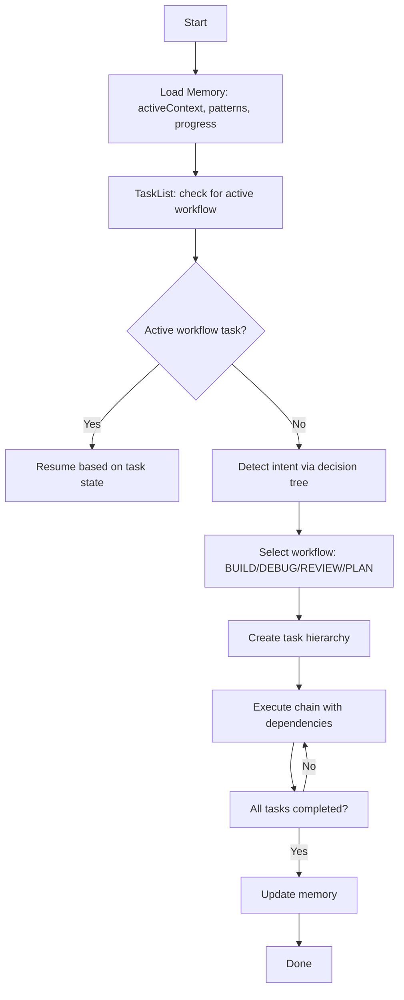
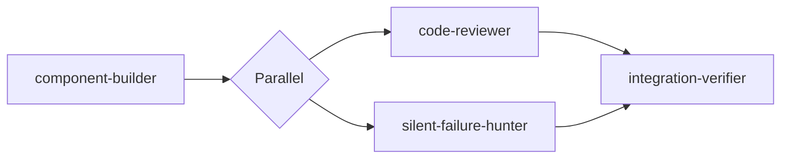

# CC10x Orchestration Bible (Plugin-Only Source of Truth)

> **Last reviewed against live plugin files:** 2026-03-21 (`v10.1.4` product line: planner-owned fresh review loop, prompt safety system, latency-safe verifier telemetry, router-owned orchestration, versioned v10 state, workflow replay fixtures) | **Status:** IN SYNC WITH CURRENT MAIN

> This document is derived **only** from `plugins/cc10x/` (agents + skills).
> Ignore all other docs. Do not trust external narratives.

---

## Purpose

The orchestration layer is the system. If orchestration breaks, CC10x breaks.
This document defines the **non-negotiable** routing, tasking, agent chaining, and memory protocols that MUST remain intact.

---

## Glossary (Plugin Terms)

- **Router**: The execution engine defined by `plugins/cc10x/skills/cc10x-router/SKILL.md`.
- **Workflow**: One of BUILD, DEBUG, REVIEW, PLAN.
- **Agents**: `component-builder`, `bug-investigator`, `code-reviewer`, `silent-failure-hunter`, `integration-verifier`, `planner`, `plan-gap-reviewer`, `web-researcher`, `github-researcher`.
- **Skills**: Specialized rulebooks in `plugins/cc10x/skills/*/SKILL.md`.
- **Memory**: `.claude/cc10x/{activeContext.md, patterns.md, progress.md}`.
- **Router Contract**: Machine-readable output signal used by the router for validation. WRITE agents emit YAML. READ-ONLY agents emit an envelope-first contract on line 1 and a stable heading fallback on line 2.
- **Dev Journal**: User transparency section in WRITE agent output only (narrative of what was done). Removed from READ-ONLY agents in v8.0.0 to reduce token pressure.

---

## Skills vs Agents (Claude Code Concepts)

> This section documents the Claude Code platform concepts that CC10x is built on.
> Source: Claude Code official documentation. This is reference for maintainers.

### What is a Skill?

A **skill** is a Markdown file (`SKILL.md`) with optional YAML frontmatter. It provides instructions, reference material, or task workflows that teach Claude how to do something. Skills do NOT execute — they INSTRUCT.

**Skill frontmatter fields:**
```yaml
name: skill-name          # Identifier (lowercase, hyphens)
description: "..."        # When Claude should use this skill
allowed-tools: Read, Grep # Tools that skip permission prompts when skill is active
```

**Key facts:**
- `allowed-tools` is **NOT runtime enforcement**. It defines which tools skip permission prompts. The agent's `tools:` field controls actual tool availability.
- Skills are loaded as text context.
- Large preloaded skills increase startup context and contradiction risk.
- Skills cannot call tools themselves. They instruct the hosting agent to call tools.

### What is an Agent?

An **agent** is a Markdown file with YAML frontmatter that defines an isolated subprocess. When invoked via the subagent/task mechanism, Claude Code spawns a new process with its own context window, tools, and instructions.

**Agent frontmatter fields:**
```yaml
name: agent-name          # Identifier
tools: Read, Edit, Bash   # Actual tool allowlist (enforced at runtime)
skills: skill-a, skill-b  # Skills to preload (full content injected at startup)
model: inherit            # Model to use
```

**Key facts:**
- `tools:` is the **actual runtime allowlist**. Agent can ONLY use tools listed here.
- `skills:` preloads full skill content into the agent's startup context. Keep this list minimal.
- Agent outputs are returned to the caller (router) as a single result.
- Plain subagents do not provide team-style orchestration for free. CC10X implements that layer itself using tasks, workflow metadata, and router rules.

Agents spawned via Task() run in isolated context windows by default — they cannot see the parent conversation, CLAUDE.md, or other agents' outputs. No frontmatter configuration is required for isolation.

### Skills vs Agents — The Distinction

| Aspect | Skill | Agent |
|--------|-------|-------|
| **Nature** | Instructions (text) | Execution unit (subprocess) |
| **Runs as** | Context injected into an agent | Isolated process with own context window |
| **Can use tools?** | No — instructs the hosting agent to use tools | Yes — has its own `tools:` allowlist |
| **Can see parent context?** | Only if loaded into parent; forked agents cannot see parent | No (isolated by default) |
| **Loaded via** | Agent frontmatter `skills:` (automatic) or `Skill()` call (on-demand) | `Task(subagent_type="...")` |
| **Frontmatter tool field** | `allowed-tools` (permission hint, NOT enforcement) | `tools` (actual allowlist, enforced) |

### How CC10x Uses This Architecture

**9 Agents (execution units):**
- `component-builder` — Builds features (has Edit, Write, Bash)
- `bug-investigator` — Debugs issues (has Edit, Write, Bash)
- `planner` — Creates plans (has Edit, Write, Bash for plan files + memory only)
- `plan-gap-reviewer` — Fresh read-only plan challenge pass (no Edit, no Write)
- `code-reviewer` — Reviews code (READ-ONLY: no Edit, no Write)
- `silent-failure-hunter` — Finds silent failures (READ-ONLY: no Edit, no Write)
- `integration-verifier` — Verifies E2E (READ-ONLY: no Edit, no Write)
- `web-researcher` — Executes web research (Bright Data + WebSearch); spawned by router in parallel
- `github-researcher` — Executes GitHub research (Octocode MCP); spawned by router in parallel

**12 Skills (instruction sets referenced by agents/router):**
- `cc10x-router` — Orchestration engine (loaded by main Claude, not agents)
- `session-memory` — Memory protocol (WRITE agents only)
- `code-generation` — Code writing patterns (component-builder)
- `test-driven-development` — TDD protocol (component-builder, bug-investigator)
- `debugging-patterns` — Debug methodology (bug-investigator only — removed from integration-verifier in v6.0.29)
- `code-review-patterns` — Review methodology (code-reviewer, silent-failure-hunter)
- `verification-before-completion` — Verification gates (4 agents)
- `planning-patterns` — Plan writing (planner)
- `brainstorming` — Idea exploration (router PLAN workflow in main context — NOT planner frontmatter)
- `architecture-patterns` — Architecture guidance (loaded conditionally via SKILL_HINTS)
- `frontend-patterns` — Frontend guidance (loaded conditionally via SKILL_HINTS)
- `research` — Synthesis guidance (passed as SKILL_HINTS to planner/bug-investigator when parallel research files are available — NOT router-executed inline)

### Research Architecture

Research runs as parallel agents spawned directly by the router (same pattern as `code-reviewer ∥ silent-failure-hunter`):

```
Router detects research need
  → Task(cc10x:web-researcher) [parallel]   → docs/research/{date}-{topic}-web.md
  → Task(cc10x:github-researcher) [parallel] → docs/research/{date}-{topic}-github.md
  Both complete → router collects both FILE_PATHs
  → Router passes both paths to planner or bug-investigator
```

The `cc10x:research` skill provides synthesis guidance (loaded via SKILL_HINTS by planner/bug-investigator).
The router never executes research inline.

**Why this separation:**
1. **Agents are isolated** — code-reviewer cannot accidentally edit files because its `tools:` field excludes Edit/Write. This is enforced by Claude Code, not by English instruction.
2. **CC10X owns workflow coordination** — workflow metadata, resume logic, remediation loops, and memory conventions are custom CC10X behavior layered above Claude Code primitives.
3. **Minimal preload beats maximal preload** — only core workflow skills should live in agent frontmatter; everything else should load on demand.
4. **SKILL_HINTS bridge the gap** — Forked agents cannot see CLAUDE.md. The router reads approved project hints and passes only relevant skills into the agent prompt.

### Official Platform vs CC10X Layer

| Layer | Owned By | Examples |
|-------|----------|----------|
| Claude Code platform | Anthropic | subagents, tool allowlists, hooks, settings, `Skill()` loading |
| CC10X orchestration | This plugin | BUILD/DEBUG/REVIEW/PLAN, `wf:` metadata, REM-FIX loops, `.claude/cc10x/*.md`, `memory_task_id` transient hint |

### Hook-Owned Invariants (Recommended)

Prompt text is not the strongest enforcement layer. These rules should move to hooks or harness code when possible:
- reject Memory Update if anything tries to spawn it as a subagent
- validate required `wf/kind/origin/phase/plan/scope/reason` metadata on CC10X task creation
- audit workflow artifact integrity after router-owned writes
- clean orphaned test processes after write-agent completion
- enforce read-only agents not writing outside approved paths
- optionally reject malformed read-only contract envelopes before router fallback logic

### Plugin Packaging Rules

For marketplace/plugin installs, shipped runtime behavior must live inside the plugin bundle:
- plugin manifest: `.claude-plugin/plugin.json`
- plugin hooks: `hooks/hooks.json`
- plugin hook scripts: `scripts/*` referenced via `${CLAUDE_PLUGIN_ROOT}`
- optional user-configured MCP acceleration via Claude Code MCP settings

Repo-local `.claude/settings.json` is not part of the shipped plugin contract.

### Stability Harness (Current State)

The current main branch includes two non-runtime but load-bearing safety tools:
- `plugins/cc10x/scripts/cc10x_harness_audit.py`
  - validates manifest/docs/marketplace drift
  - validates shipped hooks and MCP references
  - validates router-consumed agent contract fields
- `plugins/cc10x/scripts/cc10x_workflow_replay_check.py`
  - validates deterministic workflow-routing and contract scenarios from fixtures
  - covers PLAN / BUILD / DEBUG / REVIEW / VERIFY regression paths without a live Claude session

These are part of the maintenance contract even though they are not invoked by the router at runtime.

### External Skill Conflict Risk (Design Decision)

Claude Code auto-loads descriptions of ALL installed skills (global + project + plugins) into the main context. External skills with broad trigger descriptions can conflict with CC10x routing — Claude might invoke them instead of or alongside the router. **CLAUDE.md's Complementary Skills table is the ONLY approved channel for external skills.** It ensures the user has explicitly vetted compatibility. Do not implement auto-discovery of installed skills.

---

## Orchestration Invariants (Never Break)

1. **Router is the ONLY entry point.** Every development task must pass through it.
2. **Memory load is mandatory before any decision.**
3. **Task-based orchestration is mandatory.** All workflows use tasks with dependencies.
4. **Workflow selection uses the decision tree in priority order.**
5. **Agent chain must complete.** No workflow is done until its chain is complete.
6. **Parallel execution must be in a single message.**
7. **Research is prerequisite if triggered, and MUST be persisted.**
8. **Memory must be updated at the end of a workflow.**

---

## Decision Tree (Routing)

Priority order (highest wins):

1. **ERROR** → DEBUG
   Keywords: error, bug, fix, broken, crash, fail, debug, troubleshoot, issue, problem, doesn't work
2. **PLAN** → PLAN
   Keywords: plan, design, architect, roadmap, strategy, spec, "before we build", "how should we"
3. **REVIEW** → REVIEW
   Keywords: review, audit, check, analyze, assess, "what do you think", "is this good"
4. **DEFAULT** → BUILD

Conflict rule: **ERROR always wins** (e.g., “fix the build” = DEBUG).

---

## High-Level Orchestration Diagram


```mermaid
flowchart TD
  A[Start] --> B[Load Memory: activeContext, patterns, progress]
  B --> C[TaskList: check for active workflow]
  C --> D{Active workflow task?}
  D -->|Yes| E[Resume based on task state]
  D -->|No| F[Detect intent via decision tree]
  F --> G[Select workflow: BUILD/DEBUG/REVIEW/PLAN]
  G --> H[Create task hierarchy]
  H --> I[Execute chain with dependencies]
  I --> J[All tasks completed?]
  J -->|No| I
  J -->|Yes| K[Update memory]
  K --> L[Done]
```

---

## Task-Based Orchestration (Mandatory)

### Task Hierarchies (Canonical)

**BUILD**
- Parent: `CC10X BUILD: {feature_summary}`
- Agents:
  - `component-builder` (no dependencies)
  - `code-reviewer` (blocked by component-builder)
  - `silent-failure-hunter` (blocked by component-builder)
  - `integration-verifier` (blocked by reviewer + hunter)
  - `Memory Update` (blocked by integration-verifier) ← TASK-ENFORCED

**DEBUG**
- Parent: `CC10X DEBUG: {error_summary}`
- Agents:
  - `bug-investigator`
  - `code-reviewer` (blocked by bug-investigator)
  - `integration-verifier` (blocked by code-reviewer)
  - `Memory Update` (blocked by integration-verifier) ← TASK-ENFORCED

**REVIEW**
- Parent: `CC10X REVIEW: {target_summary}`
- Agent: `code-reviewer`
- `Memory Update` (blocked by code-reviewer) ← TASK-ENFORCED

**PLAN**
- Parent: `CC10X PLAN: {feature_summary}`
- Agent: `planner`
- `Memory Update` (blocked by planner) ← TASK-ENFORCED

### Task Execution Loop (Required)

1. `TaskList()` → find tasks with `status=pending` and no blockers.
2. `TaskUpdate({ taskId, status: "in_progress" })`
3. Run agent(s). If more than one is ready, **invoke in the same message** (parallel).
4. Agent self-reports: calls `TaskUpdate({ taskId, status: "completed" })` in its final output. Router validates via `TaskList()` and calls `TaskUpdate` as fallback if status is still `in_progress`.
5. Repeat until **ALL** agent tasks are completed.

**Note (v6.0.29+):** Agents DO call TaskUpdate for their own task (self-completion). Router applies a fallback if the agent missed it. Both are defense-in-depth — not a contradiction. `Task()` return is the deterministic handoff point for the router to validate.

### Tasks Tool Contract (Keep Examples Exact)

CC10x orchestration relies on Claude Code Tasks. Keep every example aligned with the tool schema:

- `TaskCreate({ subject, description, activeForm })`
- `TaskUpdate({ taskId, status, description, subject, activeForm, owner, addBlockedBy, addBlocks })` where `status ∈ pending|in_progress|completed|deleted`
- `TaskList()`, `TaskGet({ taskId })`

**Do not rely on non-standard fields (e.g., `metadata`) unless verified in the runtime.**
If extra context is needed (plan file, repo scope, agent name), put it in `subject` / `description` so it is always available via `TaskList` / `TaskGet`.
`description` field is supported and used by the router's step 3a to capture Memory Notes (compaction-safe).

---

## Agent Chain Protocols

### BUILD Chain (Strict)


```mermaid
flowchart LR
  A[component-builder] --> B{Parallel}
  B --> C[code-reviewer]
  B --> D[silent-failure-hunter]
  C --> E[integration-verifier]
  D --> E
```

**Parallel rule:** code-reviewer + silent-failure-hunter must be invoked **together**.
**Do not run integration-verifier until BOTH complete.**

### DEBUG Chain
`bug-investigator → code-reviewer → integration-verifier`

### REVIEW Chain
`code-reviewer` only

### PLAN Chain
`planner` → `plan-gap-reviewer` (bounded fresh-review loop, router-owned) → `planner` revision if needed → `planner` runs `plan-review-gate` inline before returning a final plan

**Notes:**
- `plan-gap-reviewer` is a fresh read-only subagent. It never owns orchestration, memory, or plan approval.
- `plan-review-gate` still runs inside the planner agent's context — not a separate router step. BUILD/DEBUG/REVIEW chains are unaffected.

---

## Memory Protocol (Required)

### Load (Before Routing)

**Step 1 (MUST complete first):**
```
mkdir -p .claude/cc10x
```

**Step 2 (AFTER Step 1):**
```
Read .claude/cc10x/activeContext.md
Read .claude/cc10x/patterns.md
Read .claude/cc10x/progress.md
```

**Do NOT parallelize Step 1 and Step 2.**

### Update (After Workflow)

**WRITE agents** (component-builder, bug-investigator, planner):
- Update memory directly using `Edit(...)` + `Read(...)` verify pattern
- Have session-memory skill for full protocol

**READ-ONLY agents** (code-reviewer, silent-failure-hunter, integration-verifier):
- Do NOT have Edit tool - cannot update memory directly
- Output `### Memory Notes (For Workflow-Final Persistence)` section
- Memory Notes persisted via task-enforced "CC10X Memory Update" task

**Memory load + update are non-negotiable.**

**Parallel safety (BUILD only):**
- During the parallel phase (`code-reviewer ∥ silent-failure-hunter`), **neither agent updates memory**.
- Both are READ-ONLY and output Memory Notes sections.
- Memory Update task persists all Memory Notes **after** all agents complete (task-enforced).

**Workflow-Final Memory Persistence (Task-Enforced):**
- Each workflow has a "CC10X Memory Update" task blocked by the final agent
- When this task becomes available, collect Memory Notes and persist:
  1. Learnings to `activeContext.md ## Learnings`
  2. Patterns/gotchas to `patterns.md ## Common Gotchas`
  3. Verification evidence to `progress.md ## Verification`
- Task-enforced ensures persistence survives context compaction

**Memory contract (never break anchors):**
- Do not rename the top-level headers or section headers in `.claude/cc10x/*.md`.
- After any `Edit(...)`, `Read(...)` back and confirm the intended change exists. If not, STOP and retry with a correct `old_string` anchor.

### Template Validation Gate (Auto-Heal)

After loading memory files, the router MUST ensure all required sections exist. This prevents `Edit` failures on projects with older/incomplete memory templates.

**Required sections by file:**

| File | Required Sections |
|------|-------------------|
| `activeContext.md` | `## Current Focus`, `## Recent Changes`, `## Next Steps`, `## Decisions`, `## Learnings`, `## References`, `## Blockers`, `## Last Updated` |
| `progress.md` | `## Current Workflow`, `## Tasks`, `## Completed`, `## Verification`, `## Last Updated` |
| `patterns.md` | `## Common Gotchas` (minimum) |

**Auto-heal pattern:**
```
# If any section missing, insert before ## Last Updated:
Edit(file_path=".claude/cc10x/activeContext.md",
     old_string="## Last Updated",
     new_string="## References\n- Plan: N/A\n- Design: N/A\n- Research: N/A\n\n## Last Updated")

# VERIFY after each heal
Read(file_path=".claude/cc10x/activeContext.md")
```

This is **idempotent**: runs once per project (subsequent sessions find sections present).

**Why this exists:** v6.0.4+ uses stable section anchors. Old projects may lack these sections, causing Edit failures. Auto-heal ensures backward compatibility.

---

## Research Protocol (Only When Triggered)

Trigger conditions (any one):
- User explicitly requests research (github/best practices/etc).
- Post-2024 tech or unfamiliar integration.
- External service error or 3+ failed debug attempts.

Mandatory steps:
1. Execute research using octocode tools.
2. Persist to `docs/research/YYYY-MM-DD-<topic>-research.md`.
3. Update `activeContext.md` with research reference.
4. If gotchas found, append to `patterns.md`.

**Research is a prerequisite; do not invoke planner/bug-investigator before it’s saved.**

---

## Skill Loading Hierarchy (Definitive)

### Mechanism 1: Agent Frontmatter `skills:` (Minimal Automatic Set)

Only core workflow skills should preload automatically. Keep frontmatter short because preloaded skill text is injected into agent startup context.

| Agent | Frontmatter Skills |
|-------|-------------------|
| component-builder | session-memory, test-driven-development, code-generation, verification-before-completion |
| code-reviewer | code-review-patterns, verification-before-completion |
| silent-failure-hunter | code-review-patterns |
| integration-verifier | verification-before-completion |
| bug-investigator | session-memory, debugging-patterns, test-driven-development, verification-before-completion |
| planner | session-memory, planning-patterns |

### Mechanism 2: Conditional `Skill()` Call (Router SKILL_HINTS)

Router passes SKILL_HINTS in agent prompt. Agent invokes via `Skill(skill="{name}")`.

**Sources for SKILL_HINTS:**
1. Approved project/domain skills from `CLAUDE.md` or `patterns.md`
2. `cc10x:frontend-patterns` when the task is UI/frontend-heavy
3. `cc10x:architecture-patterns` when the task spans APIs, schemas, auth, integration boundaries, or multiple subsystems
4. `cc10x:research` when planner or investigator has research files to synthesize

**Critical flow:**
- Router runs in main Claude context → can see project hints
- Subagents run in isolated context → cannot see those hints directly
- Router bridges the gap by passing only relevant skills to agents via SKILL_HINTS

**All 6 agents have `## SKILL_HINTS (If Present)` section** instructing them to invoke skills after memory load.

**Why conditional:** Not always needed; avoids startup context bloat and reduces contradictory instructions.

---

## Agent Output Requirements (Validation Gate)

### WRITE Agent Output Format (component-builder, bug-investigator, planner)

WRITE agents output these sections (unchanged since v6.0.0):

```markdown
## {Action}: {summary}

### Dev Journal (User Transparency)
**What I Did:** [Narrative of actions taken]
**Key Decisions Made:** [Decisions + WHY]
**Alternatives Considered:** [What was rejected + reason]
**Where Your Input Helps:** [Decision points, assumptions to validate]
**What's Next:** [What user should expect from next phase]

### {Agent-Specific Results}
[TDD Evidence, Fix Evidence, Plan Phases, etc.]

### Task Status
- Task {TASK_ID}: COMPLETED

### Router Contract (MACHINE-READABLE)
```yaml
STATUS: [PASS|FAIL|FIXED|INVESTIGATING|BLOCKED|PLAN_CREATED|NEEDS_CLARIFICATION]
CONFIDENCE: [0-100]
BLOCKING: [true|false]
REQUIRES_REMEDIATION: [true|false]
REMEDIATION_REASON: [null or exact text for REM-FIX task]
MEMORY_NOTES:
  learnings: ["..."]
  patterns: ["..."]
  verification: ["..."]
```
**CONTRACT RULE:** [Agent-specific validation criteria]
```

### READ-ONLY Agent Output Format (code-reviewer, silent-failure-hunter, integration-verifier)

READ-ONLY agents use an envelope-first contract. The router parses line 1 first, then falls back to the stable heading on line 2 if the envelope is missing or malformed.

```markdown
CONTRACT {"s":"APPROVE|CHANGES_REQUESTED|CLEAN|ISSUES_FOUND|PASS|FAIL","b":true|false,"cr":0}
## {Status Heading}
<!-- code-reviewer:         ## Review: Approve  OR  ## Review: Changes Requested -->
<!-- silent-failure-hunter: ## Error Handling Audit: CLEAN  OR  ## Error Handling Audit: ISSUES_FOUND -->
<!-- integration-verifier:  ## Verification: PASS  OR  ## Verification: FAIL -->

### Summary
[Verdict summary]

### Critical Issues
[Each bullet increments `cr` when the envelope is rebuilt by the router]

### Findings
[Evidence with file:line citations]

### Memory Notes (For Workflow-Final Persistence)
- **Learnings:** [...]
- **Patterns:** [...]
- **Verification:** [...]
```

### Router Contract by Agent

| Agent | Contract Type | STATUS Values | BLOCKING when | Key Fields |
|-------|--------------|---------------|---------------|-----------|
| component-builder | YAML | PASS, FAIL | Contract says so | TDD_RED_EXIT, TDD_GREEN_EXIT, REMEDIATION_REASON |
| bug-investigator | YAML | FIXED, INVESTIGATING, BLOCKED | STATUS != FIXED | ROOT_CAUSE, NEEDS_EXTERNAL_RESEARCH |
| planner | YAML | PLAN_CREATED, NEEDS_CLARIFICATION | Router decides from status | PLAN_FILE, CONFIDENCE, GATE_PASSED, USER_INPUT_NEEDED |
| code-reviewer | Envelope + heading fallback | APPROVE, CHANGES_REQUESTED | `b=true` or `cr>0` | `s`, `b`, `cr` |
| silent-failure-hunter | Envelope + heading fallback | CLEAN, ISSUES_FOUND | `b=true` or `cr>0` | `s`, `b`, `cr` |
| integration-verifier | Envelope + heading fallback | PASS, FAIL | `s=FAIL` | `s`, `b`, `cr` |

### Post-Agent Validation Logic

Router validation is two-track:

**WRITE agents (YAML)**
1. Parse `### Router Contract (MACHINE-READABLE)`.
2. Validate required fields for the agent.
3. Apply contract-rule overrides if the output contradicts required evidence.

**READ-ONLY agents (envelope-first)**
1. Parse line 1 `CONTRACT {json}`.
2. If envelope parsing fails, parse the stable heading on line 2.
3. Count bullets in `### Critical Issues` to confirm or override `cr`.
4. Use task state to detect self-remediation or downstream blocking.

JUST_GO:
- If `AUTO_PROCEED: true` in `activeContext.md ## Session Settings`, auto-default all non-REVERT user gates to the recommended option and log the choice.

Validation rules:
- `component-builder`: missing RED/GREEN evidence forces `STATUS=FAIL`.
- `bug-investigator`: `STATUS=FIXED` without real fix evidence forces `STATUS=FAIL` unless `NEEDS_EXTERNAL_RESEARCH=true`.
- `code-reviewer` and `silent-failure-hunter`: any critical issue forces the blocking status.
- `integration-verifier`: any critical issue or failed scenario forces `STATUS=FAIL`.
- `planner`: missing `PLAN_FILE`, low confidence, or failed inline gate forces `STATUS=NEEDS_CLARIFICATION`.

### Task Metadata Contract

Every CC10X task description starts with normalized metadata:

```text
wf:{workflow_task_id}
kind:{workflow|agent|remfix|memory|reverify|research}
origin:{router|component-builder|bug-investigator|code-reviewer|silent-failure-hunter|integration-verifier|planner}
phase:{...}
plan:{path|N/A}
scope:{ALL_ISSUES|CRITICAL_ONLY|N/A}
reason:{short reason or N/A}
```

Rules:
- `wf:` is mandatory on every task.
- `kind:` is the primary routing key for resume, counting, and task execution.
- `origin:` and `scope:` are mandatory on every `kind:remfix` task.
- `plan:` is required on workflow, agent, and memory tasks.
- The router never infers behavior from loose prose when metadata can answer it.

### Task Types

| Type | Subject Prefix | Required Metadata | Purpose |
|------|---------------|-------------------|---------|
| Workflow | `CC10X BUILD:` / `DEBUG:` / `REVIEW:` / `PLAN:` | `wf`, `kind:workflow`, `origin:router`, `phase`, `plan` | Parent workflow state |
| Agent | `CC10X {agent}:` | `wf`, `kind:agent`, `origin:router`, `phase`, `plan` | Agent work item |
| Remediation | `CC10X REM-FIX:` | `wf`, `kind:remfix`, `origin`, `phase`, `plan`, `scope`, `reason` | Deterministic self-healing |
| Re-verify | `CC10X integration-verifier: Re-verify —` | `wf`, `kind:reverify`, `origin:router`, `phase:re-verify`, `plan` | Post-remediation verification |
| Memory | `CC10X Memory Update:` | `wf`, `kind:memory`, `origin:router`, `phase:memory-finalize`, `plan` | Inline persistence only |
| Research | `CC10X Research:` | `wf`, `kind:research`, `origin:router`, `phase:research`, `reason` | External research loop |

`CC10X TODO:` tasks are abolished. Non-blocking discoveries belong in `### Memory Notes` under `**Deferred:**`.

### Hydration And Resume

Task lists are treated as potentially long-lived/shared. Resume is workflow-scoped:

1. Read memory files.
2. `TaskList()` and identify active parent workflow tasks.
3. Extract `wf:` from the chosen parent task.
4. Read only tasks whose descriptions contain that `wf:`.
5. Reconstruct runnable tasks from `kind`, `status`, and `blockedBy`.
6. Reconstruct the memory task from the unique pending/in-progress `kind:memory` task in the same workflow.

`[cc10x-internal] memory_task_id` in `activeContext.md ## References` is only a transient hint. It may be written during workflow execution for compaction safety, but it must never be treated as durable truth and must be removed by the Memory Update task when that workflow completes.

### Remediation Re-Review Loop

When a `kind:remfix` task completes:

1. Count completed `kind:remfix` tasks in the same `wf:`. If the cycle cap is reached, ask the user before creating another remediation loop.
2. Create a `kind:agent` re-review task.
3. In BUILD, create a `kind:agent` re-hunt task.
4. Reuse the pending verifier in the same workflow if one exists; otherwise create a new `kind:reverify` task.
5. Block verifier execution on re-review and re-hunt.
6. Re-block the `kind:memory` task on the verifier so persistence happens last.

Routing for remediation tasks is metadata-driven:
- `origin:bug-investigator` → bug-investigator executes the REM-FIX.
- `origin:code-reviewer|silent-failure-hunter|integration-verifier` → component-builder executes the REM-FIX.

### Agent Invocation Template

The router passes:
- `Task ID`
- `Parent Workflow ID`
- `Plan File`
- `User Request`
- `Memory Summary`
- `Project Patterns`
- `SKILL_HINTS`

Rules:
- WRITE agents emit `### Dev Journal` and YAML router contract.
- READ-ONLY agents emit line-1 envelope, line-2 heading fallback, and `### Memory Notes`.
- Agents must never tell the user they are complete without either calling their valid task tool or letting the router complete them via fallback.
- Router-owned user interaction stays in the router. Agents surface clarification through structured output, not direct user questioning, unless they actually have that capability.

### Critical Gating Checklist

1. MEMORY_LOADED
2. TASKS_CHECKED
3. WORKFLOW_SCOPED
4. TASKS_CREATED_OR_HYDRATED
5. RESEARCH_EXECUTED_AND_PERSISTED (if triggered)
6. AGENT_OUTPUT_VALIDATED
7. ALL_TASKS_COMPLETED_IN_WF
8. MEMORY_UPDATED_INLINE

### Non-Optional Behaviors (Hard Rules)

- Never stop after one agent if the workflow still has runnable tasks.
- Never use unscoped task lookup in critical paths.
- Never treat stored task IDs as durable identity across workflows.
- Never try to reactivate a completed task with `addBlockedBy`; create a new runnable task if needed.
- Never spawn Memory Update as a sub-agent; it executes inline in the router.
- Never create `CC10X TODO:` tasks.
- `cc10x-router` must run in the main Claude Code session context.

---

## Concurrent Session Warning

`.claude/cc10x/` memory files are single-tenant. Running multiple cc10x sessions concurrently in the **same repository directory** causes:
- Silent data corruption (progress.md pre-populated with wrong data)
- Memory files overwritten mid-workflow by sibling sessions
- No error — failures are invisible

**One cc10x session per repository at a time.** If you need parallel workflows, use separate repository clones.

---

## Task State Transitions (Non-Negotiable)

```
┌─────────┐       ┌─────────────┐       ┌───────────┐
│ pending │──────►│ in_progress │──────►│ completed │
└─────────┘       └─────────────┘       └───────────┘
     │                   │
     │                   │
     └───────────────────┴──────────► deleted
```

**State Transitions:**
- `pending` → `in_progress`: When agent starts work
- `in_progress` → `completed`: When agent finishes
- Any → `deleted`: When task removed

**A task is available when:**
- status = `pending`
- blockedBy list is empty (all dependencies resolved)

**Blocked Tasks:**
- Task with non-empty `blockedBy` cannot become `in_progress`
- When blocking task completes, blocked task automatically becomes available

---

## Compaction Safety (Memory Notes Persistence)

Context compaction can destroy in-flight agent notes. CC10X survives this by persisting notes into the workflow-scoped memory task as soon as each agent returns:

1. Extract `### Memory Notes` from the agent output.
2. Append them to the `kind:memory` task description for the same `wf:`.
3. Optionally write `[cc10x-internal] memory_task_id: {id} wf:{workflow_task_id}` to `activeContext.md ## References` as a transient hint.
4. When the Memory Update task executes inline, it reads only its own description payload, persists the notes to `.claude/cc10x/*.md`, and removes the matching transient `memory_task_id` line.

This is why Memory Notes survive compaction and cross-turn truncation.

---

## Key Loop Caps (Safety Mechanisms)

| Cap | Location | Threshold | Purpose |
|-----|----------|-----------|---------|
| Circuit Breaker | Before REM-FIX creation | 3 active REM-FIX tasks | Detects pile-up of simultaneous fixes |
| Cycle Cap | Start of Re-Review Loop | 2 completed REM-FIX tasks | Detects recurring fix loops |
| INVESTIGATING cap | rule 2c | 3 re-invocations | Prevents infinite investigation |
| NEEDS_EXTERNAL_RESEARCH cap | rule 0c | 2 research iterations | Limits external API calls |

**Circuit Breaker counts ACTIVE tasks; Cycle Cap counts COMPLETED tasks.** These are semantically different and must not be confused.

---

## DEBUG-RESET (Workflow-Scoped Attempt Counting)

Bug-investigator writes a `[DEBUG-RESET: wf:{parent_task_id}]` marker to `## Recent Changes` at the start of each DEBUG workflow (the router also writes an explicit Edit for the marker in the DEBUG workflow setup). Debug attempts (`[DEBUG-1]:`, `[DEBUG-2]:`, etc.) are anchored AFTER this marker. Only attempts after the most recent marker count toward the 3-attempt research trigger. This prevents stale attempts from prior sessions triggering research on a fresh workflow.

---

## Deferred Findings Pattern (v6.0.31+)

Agents write non-blocking discoveries to Memory Notes under `**Deferred:**` instead of creating tasks. The Memory Update task writes them to `patterns.md ## Common Gotchas` as `[Deferred vX.Y.Z]: {entry}`. Tasks are execution state — not a knowledge parking lot.

---

## Standalone Skills (Not in Agent Chains)

These skills run inline inside an agent context and do not own orchestration state transitions.

| Skill | Trigger | What It Does |
|-------|---------|-------------|
| `cc10x:plan-review-gate` | Called by planner after saving a plan | Runs inline feasibility/completeness/scope checks and returns `GATE_PASS` or blocking issues. It does not question the user directly and does not create tasks. |

**Safety note:** Inline skills provide reference logic only. Router-owned workflow and task transitions remain in the router.

---

## Known Behavioral Guarantees (v9 alignment)

These are the current guarantees enforced by the live router/agent files:

| Guarantee | Enforced By |
|-----------|-------------|
| Memory Update always runs inline in the router | Router chain execution loop + `kind:memory` |
| Resume is workflow-scoped, not task-ID-scoped | Router hydration rules using `wf:` + `kind:` |
| `memory_task_id` is a transient optimization only | Router hydration rules + session-memory skill |
| Every remediation task carries explicit `wf`, `kind:remfix`, `origin`, `scope`, and `reason` metadata | Router task schema + reviewer/verifier self-healing templates |
| Re-review routing is based on `origin:` metadata, not subject prose | Router remediation routing |
| Planner and builder-side inline skills no longer tell the model to use impossible task/question tools | Planner, planning-patterns, plan-review-gate, code-generation |
| READ-ONLY agents use envelope-first contracts with heading fallback | code-reviewer, silent-failure-hunter, integration-verifier, router validation |
| Router-owned user questioning is separate from agent clarification output | Router rules + agent prompt cleanup |
| `AUTO_PROCEED` depends on `## Session Settings` and that section is required in memory templates | Router template validation + session-memory template |
| Non-blocking discoveries belong in memory, not TODO tasks | Router hard rules + deferred findings pattern |

---

## Final Reminder

This Bible is the contract.
Any change to routing, task orchestration, parallel execution, or memory gates **must be evaluated against this doc first**.
